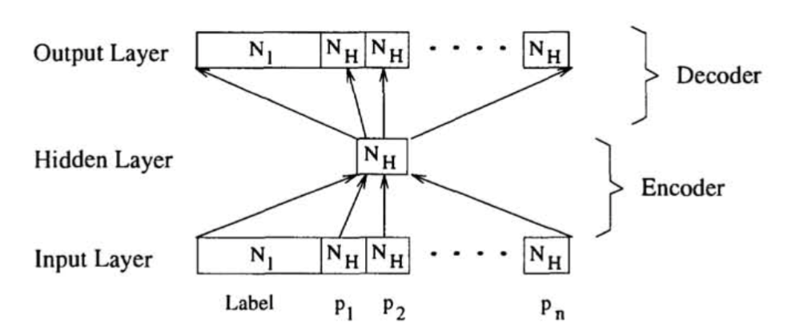

過去数年間で、多くの研究者がリスト、ツリー、スタックなどの記号的構造が、結合主義的なシステム内でどのように表現され操作されるかを示そうと試みてきました。この際、結合主義の全ての計算的特徴を保持しつつ（そしてそれを記号的表現へ拡張しつつ）行われています（Hinton, 1990; Plate, 1991; Pollack, 1990; Smolensky, 1990; Touretzky, 1990）。目的は、構造化されたタスクの領域を扱う際に結合主義的アプローチの可能性を明らかにすることです。彼らのアイデアの共通の背景は、遠隔アクセスとそれに続く合成性を達成する試みです。Pollackによって提案されたRAAMモデル（Pollack, 1990）は、ニューラルネットワークが固定された分岐係数を持つツリーのコンパクトな再帰分散表現をどのように発見できるかを示す一例です。

この論文では、RAAMの拡張であるLabeling RAAM (LRAAM) を紹介します。LRAAMは、表現される構造の各構成要素にラベルを付けて保存することができるため、ラベル付きグラフの縮小表現を生成することができます。さらに、LRAAMでエンコードされたデータはポインタによるアクセスだけでなく、内容によるアクセスも可能です。第2章ではネットワークを紹介し、モデルの技術的な側面について議論します。第3章では、内容によるデータへのアクセスの可能性を紹介し、第4章ではいくつかの安定性結果を紹介します。そして第5章で討論と結論で論文を締めくくります。