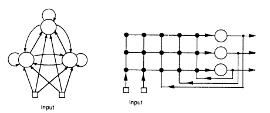

# 3 Formal Assumptions and Definitions 
## 3.1 Network Architecture and Dynamics

すべてのアルゴリズムは、ネットワークが完全にセミリニアユニットで構成されているという前提に基づいています。
（セミリニアユニットとは、ニューラルネットワークにおいて、入力と出力の関係が線形部分と非線形部分に分けられるユニットを指します。通常、入力の重み付き和がまず計算され、その後、非線形関数（例えばシグモイド関数やReLU関数など）が適用される形式です。）

ここで採用するもう一つの前提は、連続時間ではなく、離散時間の使用です。

ネットワークがn個のユニットを持ち、m個のexternal input linesを持つとします。

（この文で述べられている「input lines（入力ライン）」についてですが、他の人たちがこれを「input units（入力ユニット）」と呼ぶことを選択しているのに対して、著者は「入力ライン」と呼ぶことを好んでいます。その理由は、入力ラインは計算を行わないため、ユニット（計算単位）と見なすべきではないと考えているからです。

著者は、入力ラインは単にデータを受け取って伝達するだけで、計算処理を行う役割を持っていないため、「ユニット」と呼ぶのは適切ではないとしています。代わりに、別の妥当な呼び方として「input terminals（入力端子）」と呼ぶこともできると述べています。

要するに、この部分では、入力に対して計算処理を行わない部分を「ユニット」と呼ぶのは誤解を招くため、それを避けているということです。）

$
\vec{y(t)}
$
(1 x n)を、時刻tにおけるネットワーク内のユニットの出力のn個組、
$
\vec{x^{net}(t)}
$
(1 x m)を、時刻tにおけるネットワークへの外部入力信号のm個組とします。

$
\vec{x(t)}
$
を、
$
\vec{x^{net}(t)}
$
と
$
\vec{y(t)}
$
(1 x (m + n))を何らかの便利な方法で連結して得られる(m + n)個組と定義します。

$
\vec{x(t)}
$
のユニット出力を表す成分と、外部入力値を表す成分を区別するために、k番目の成分
$
x_k
$
がネットワーク内のユニットの出力であるようなインデックスの集合をUとし、
$
x_k
$
が外部入力であるインデックスの集合をIとします。

$$x_k(t) = 
\begin{cases} 
x_k^{net}(t) & \text{if } k \in I \\
y_k(t) & \text{if } k \in U
\end{cases} \quad \text{(1)}$$

例えば、ゼロベースの配列インデックスを使用するコンピュータ実装では、ユニットと入力ラインを  $ [0, m+n] $  の範囲の整数でインデックスすることが便利です。

この場合、 $ [0, m] $  のインデックスは入力ラインに対応し、 $ [m, m+n] $  のインデックスはネットワーク内のユニットに対応します。

この表記法の結果として、 $ x_k(t) $  と  $ y_k(t) $  は、 $ k \in U $  のときに同じ量を示す2つの異なる名前であることに注意してください。

我々がこの表記を使用する背後にある一般的な考え方は、 $ x $  で表される変数は入力を表し、 $ y $  で表される変数は出力を表すというものです。

ネットワークの重み行列を  $  \mathbf{W}(n \mathbf{\times} (m + n))  $  とし、各ユニット間および各入力ラインから各ユニットへのユニークな重みを持つものとします。

$$w_{ij} = 
\begin{cases} 
j番目のユニットからi番目のユニットへの接続の重み & \text{if } k \in U \\
j番目の入力ラインからi番目のユニットへの接続の重みを表す & \text{if } k \in I
\end{cases} \quad $$

さらに、各ユニットにバイアスを設定するために、値が常に1である入力を  $  m  $  本の入力ラインに含め、そのユニット  $  i  $  のバイアスを重み行列の  $  i  $  番目の要素として対応する列に含めます。

一般に、この命名規則により、重み  $  w_{ij}  $  は  $  x_j  $  を「シナプス前」の信号、 $  y_i  $  を「シナプス後」の信号と見なします。

図1は、3つのユニット、2つの入力ライン、および3×5の重み行列を持つ完全に接続されたネットワークを示しています。

> 図1：3つのユニットと2つの入力ラインを持つ完全に接続された再帰型ネットワークの2つの表現を示します。

> 1つの入力ラインはバイアスとして機能し、定数値1を持つことがあります。

> これらの3つのユニットの任意のサブセットがネットの出力ユニットとして機能し、残りのユニットは隠れユニットとして扱われます。

> このネットワークの3×5の重み行列は、右側のバージョンにおける太い点の配列に対応します。

ここで使用される半線形ユニットについて、各  $ k $  に対して中間変数  $ s_k(t) $  を導入することが便利です。

これは、時刻  $ t $  における  $ k $  番目のユニットへの正味の入力を表します。その値は、時刻  $ t+1 $  で、時刻  $ t $  におけるネットワークの状態および入力の両方に基づいて計算されます：

$$
s_k(t + 1) = \sum_{l \in U} w_{kl} y_l(t) + \sum_{l \in I} w_{kl} x^{\text{net}}_l(t) = \sum_{l \in U \cup I} w_{kl} x_l(t). \quad (2)
$$

ここでは、これを2つの同等の形式で記述しています。長い方は、ユニット出力と外部入力の両方が計算にどのように使用されるかを明確に示し、よりコンパクトな表現は、なぜ  $ x $  と対応するインデックス付け規約を導入したのかを示しています。今後は、後者の形式のみを使用し、 $ x^{\text{net}} $  やその個々の座標への明示的な言及を避けます。

このようなユニットの時刻  $ t + 1 $  における出力は、正味の入力に関して次のように表されます：

$$
y_k(t + 1) = f_k(s_k(t + 1)), \quad (3)
$$

ここで、 $ f_k $  はユニットのSquashing Function（入力を特定の範囲内に押し込む（"squash"する）ための関数で、Activation Functionの一つ。典型的には、出力を0から1、もしくは-1から1の範囲に制限する。例としてはシグモイド関数）です。

この章の多くでは、ネットワーク内のさまざまなユニットが使用するSquashing Functionの性質について特定の仮定は行わず、微分可能であることだけを要求します。

これらのSquashing Functionについて特定の仮定が必要な場合には、すべてのユニットがロジスティック関数を使用するものとします。

したがって、方程式 (2) および (3) は、 $ k $  が  $ U $  を範囲とするネットワークの離散時間動力学全体を構成し、 $ x_k $  の値は方程式 (1) によって定義されます。

時刻  $ t $  の外部入力は、時刻  $ t + 1 $  までの任意のユニットの出力に影響を与えないことに注意してください。このようにして、すべての接続が1タイムステップの遅延を持つものとして扱います。ここで提示された解析は、異なる接続が異なる遅延を持つ状況に拡張するのは難しくありません。後に、一部の接続に遅延がない特定のケースについての観察を行います。

この章全体で行われる導出は、方程式 (2) および (3) によって与えられる特定の離散時間動力学に従っていますが、オイラー離散化を適用して連続時間ネットワークに対して得られた代替の定式化の使用に注目する価値があります。例えば、次の動的方程式から始めるとします：

$$
\tau_k \dot{y_k}(t) = -y_k(t) + f_k(s_k(t)), \quad (4)
$$

ここで、 $ s_k(t) $  は前述のように方程式 (2) で定義され、次に  $ \Delta t $  のサンプリング間隔で離散化すると、離散時間方程式が生じることが容易に示されます：

$$
y_k(t + \Delta t) = \left( 1 - \frac{\Delta t}{\tau_k} \right) y_k(t) + \frac{\Delta t}{\tau_k} f_k(s_k(t)). \quad (5)
$$

 $ \beta_k = \Delta t / \tau_k $  と定義し、時間スケールを変更して  $ \Delta t = 1 $  となるようにすると、次の方程式が得られます：

$$
y_k(t + 1) = (1 - \beta_k) y_k(t) + \beta_k f_k(s_k(t)), \quad (6)
$$

これにより、方程式 (3) が  $ \beta_k = 1 $  の特別な場合を表すことが明らかになります。この章全体で示されたようなアルゴリズムを、これらのより一般的な代替形式の離散時間動力学に対して導出するのは容易です。このような動力学を使用する潜在的な利点は、 $ \beta_k \ll 1 $  の場合、Tsung (1990) が観察したように、特定のタスククラスがそのようなシステムによってより容易に学習される可能性があることです。こうしたシステムの特別な利点は、ここで説明される学習アルゴリズムで使用される勾配計算が時間とともにより緩やかに減少し、その結果、「クレジット割り当て」が  $ \beta = 1 $  の場合よりも長い期間にわたってより容易に広がることです。

## 3.2 Network Performance Measure

ネットワークが行うタスクが逐次的な教師あり学習タスクであると仮定します。

これは、指定された時間に特定のユニットの出力値が指定された目標値（教師信号とも呼ばれる）と一致する必要があることを意味します。

再度述べますが、これはこれらのアプローチが適用される最も一般的な問題設定ではありませんが、ここでの目的には十分に一般的です。

T(t) を、時刻 t において k 番目のユニットの出力が一致すべき指定された目標値 $ d_k(t) $ が存在する U 内のインデックスの集合とします。

次に、時間変動する n 次組 e を次のように定義します：

$$
e_k(t) =
\begin{cases}
d_k(t) - y_k(t) & \text{if } k \in T(t) \\
0 & \text{otherwise.}
\end{cases}
$$

この定式化では、異なるユニットに対して異なる時間に目標値が指定される可能性を考慮しています。したがって、「可視」と見なされるユニットの集合は時間的に変動する可能性があります。ここで

$$
J(t) = -1/2 \sum_{k \in U} [e_k(t)]^2
$$

は、時刻 t における全体的なネットワークエラーの負の値を示します。

学習の自然な目的は、全体エラーの負の値を最大化することかもしれません。

$$
J^{\text{total}}(t', t) = \sum_{\tau = t'+1}^{t} J(\tau)
$$

は、適切な時間期間 [t', t] にわたる総エラーの負の値を示します。この量の重み空間での勾配はもちろん、

$$
\bigtriangledown_w J^{\text{total}}(t', t) = \sum_{\tau = t'+1}^{t} \bigtriangledown_w J(\tau)
$$

であることがわかります。

一般に、$ t_0 $ をネットワークがその状態を初期化する開始時刻とします。

継続的に動作するネットワークでは、状態が再初期化される時刻は他にはありませんが、エポック単位の学習では、他に  $ t_1, t_2, t_3, \dots $  といったエポック境界を示す時刻があります。あるいは、状態がエポックごとに再初期化される場合は、 $ t_0 $  から新たに開始することを考慮することもできます。この章全体を通して、ネットワークがエポック単位で動作している場合も、継続的に動作している場合も、最後に状態がリセットされた時刻を示すために  $ t_0 $  を使用します。エポック単位の場合、現在のエポックの終了を示すために  $ t_1 $  を使用します。

ここで、継続的な操作とエポック単位の操作に関するさまざまな概念と、他方で勾配計算の使用との関係を明確にするために、いくつかの具体的な定義を導入します。本章の目的のために、以下の定義を行います。

**正確な勾配計算アルゴリズム**とは、ネットワークが動作するすべてのタイムステップ  $ \tau $  において、 $ [t', t] $  という区間が含まれるようにアルゴリズムが  $ \nabla_w J^{\text{total}}(t', t) $  を時刻  $ t $  に計算する性質を持つアルゴリズムです。

ネットワークの重みが固定されているという仮定の下で、このような正確な勾配アルゴリズムがエポック単位で動作するネットワークに適用される場合、それはエポック単位のアルゴリズムと呼ばれ、エポックの終了時に  $ t_1 $  で  $ \nabla_w J^{\text{total}}(t_0, t_1) $  を計算します。

それがリアルタイムで各時刻  $ t $  に  $ \nabla_w J(t) $  を計算する場合、それはリアルタイムアルゴリズムと呼ばれます。

代わりに、アルゴリズムが  $ t $  時点で  $ \nabla_w J^{\text{total}}(t', t) $  の近似値を計算するだけであると見なされる場合、それは近似勾配計算アルゴリズムと見なされます。

ここで強調すべきことは、この意味での「正確な」勾配アルゴリズムは、重みが真に固定されている場合にのみ正確であるということです。このようなアルゴリズムは、重みが変動することを許可されている場合、その時点の重みに対して正確な勾配を計算することはできません。このような正確な勾配アルゴリズムが継続的に動作するネットワークの重みを調整するために使用される場合、それが計算するものは通常、目的とする真の勾配に対する近似にすぎません。この問題については後でさらに説明します。

**勾配ベースの学習アルゴリズム**とは、重みの変化を正確または近似の勾配計算アルゴリズムの結果に基づいて行う学習アルゴリズムのことです。

このような学習アルゴリズムの完全な仕様には、そのような勾配情報をどのように計算するかだけでなく、勾配から重みの変化をどのように決定し、いつそれらの重みの変化が行われるかも含まれている必要があります。

本章の主な焦点は勾配計算自体にあるため、我々が議論する学習アルゴリズムの詳細については、通常、その両方についてあまり言及しないことにしますが、時には学習アルゴリズム自体とアルゴリズムの勾配計算部分の違いを曖昧にすることもあります。

重みの変更を行う自然な方法は、パフォーマンス指標の勾配の正の定数倍に沿って変更することであり、したがって

$$
\Delta w_{ij} = \eta \frac{\partial J^{\text{total}}(t', t)}{\partial w_{ij}},
$$

ここで、η は正の学習率パラメータです。我々が特定の勾配ベースの学習アルゴリズムの経験的挙動を説明する場合、これが正確な重み変更の戦略となります。

重み変更のタイミングに関しては、継続的に動作するネットワークでは、適切な勾配が計算された時点で重みを調整するのが自然ですが、既に述べたように、エポック単位のケースでは、複数のエポック後に重み調整を行うのが適切な場合があります。

本章の目的のために、エポック単位の学習アルゴリズムを、エポックごとに動作し、エポックの境界でのみ重みの更新が行われる学習アルゴリズムと見なします。

一方で、リアルタイムの学習アルゴリズムは、すべてのタイムステップで重みの更新が行われるアルゴリズムです。

任意のアルゴリズムが瞬時のパフォーマンス勾配 ∇wJ(t) を計算できるならば、それをエポック単位で使用することは容易であり、単にこれらの値を時間 t1 まで累積するだけですが、後で述べるように、これは効率的な戦略ではありません。

## 3.3 複雑性の解析で使用される表記法と仮定

ここでは、この章で議論されるさまざまなアルゴリズムの計算複雑性を解析する際に使用される表記法をまとめます。

完全性を期すために、以前に紹介されたものも含めています。これらの定義は以下の通りです：

- $ n $ = ユニット数  
- $ m $ = 入力ライン数  
- $ w_U $ = ユニット間の非ゼロ重みの数  
- $ w_A $  = 調整可能な重みの数  
- $ Δ_T $  = 目標提示間のタイムステップ数  
- $ n_T $ = 1タイムステップあたりに目標が与えられるユニットの平均数  
- $ L $  = 総タイムステップ数

また、アルゴリズムの計算複雑性のオーダー（量級）を記述するための標準的な表記法も使用します。

ここで、O(φ(n)) は n の正の整数値関数の集合であり、φ(n) のいくつかの定数倍以下であるものを表します。

Ω(φ(n)) は n の正の整数値関数の集合であり、φ(n) のいくつかの定数倍以上であるものを表します。

そして、Θ(φ(n)) は O(φ(n)) ∩ Ω(φ(n)) です。

したがって、O は関心のある量の上限を記述するために使用され、Ω はこのオーダーの下限を記述するために使用され、Θ は正確なオーダーを記述するために使用されます。

すべての場合において、保存される実数の数によって空間複雑性を解析し、必要な算術演算の数によって時間複雑性を解析します。

解析対象のすべてのアルゴリズムにおいて、主要な計算は内積の一種であるため、加算と乗算がほぼ同数でカウントされます。

ここで示す解析では、ネットワークの動的挙動を実行するために必要な計算量（もちろん、使用される学習アルゴリズムに関係なく負担されるべきものです）は無視し、また、学習アルゴリズムに従って重みを実際に更新するために必要な追加の計算量も無視します。

我々の複雑性の測定は、そのような学習アルゴリズムで使用される特定の厳密な、または近似的な勾配計算方法に基づいています。

任意の固定された n に対して、ここで議論されるすべてのアルゴリズムにおける最悪のケースは、ネットワークが完全に接続されており、すべての重みが調整可能である場合に発生します。

この場合、 調整可能な重みの数は、

$
w_A = n(n + m)
$

であり、ユニット間の非ゼロ重みの数は、

$
w_U = n^2
$

となります。以下のすべてのケースにおいて、最悪のケースの挙動を解析する際、m ∈ O(n) のクラスのネットワークに制限することで、得られる数式を少し単純化します。この仮定は、例えば、特定のタスクを実行するようにさまざまなネットワークが学習される場合に適用され、この場合 m ∈ O(1) です。また、入力パターンの表現のサイズに比例してネットワーク内のユニット数を増やすことを想像できる場合にも適用されます。それゆえ、最悪のケースの解析では、w_A と w_U の両方が Θ(n^2) に属するという事実を使用します。

なお、w_A と w_U の量で複雑性を表現することは、特定のアルゴリズムの詳細が、疎行列のストレージや操作といった技術を利用して、限られた接続性を活用するように設計されていることを前提としています。あるいは、ゼロによる乗算とゼロの加算をコストのない操作として扱うこともできます。同様の注釈が Δ_T と n_T の使用にも適用されます。この章全体で導出された複雑性の結果は、表1および表2にまとめられています。
