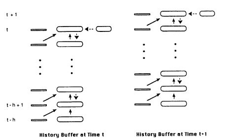
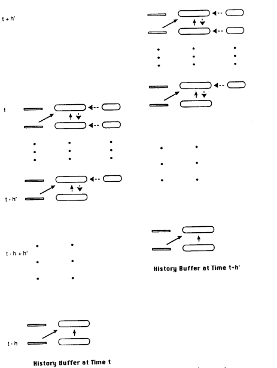
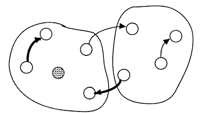
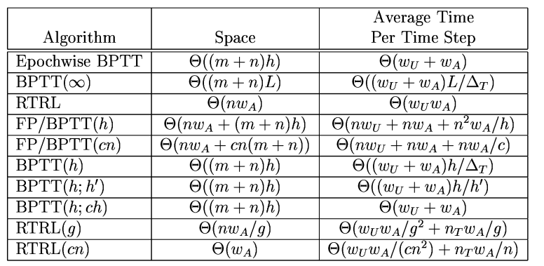
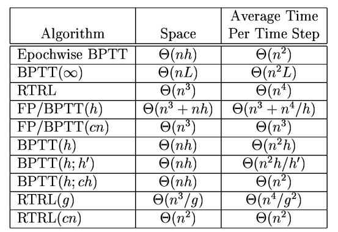

# 8 近似の戦略

これまで、我々は正確な勾配計算アルゴリズムに焦点を絞ってきました。

しかし、正確な勾配を完全に計算するために必要な計算の一部を省略するアルゴリズムを検討することが有用な場合が多々あります。

実際、これが有利である理由はいくつかあり、そのうちのいくつかは後で説明します。

主な理由は、計算の要件を簡素化することです。

## 8.1　Truncated BPTT（切り捨てBPTT）

Real time BPTTの自然な近似は、情報の逆方向伝播を、一定の過去のタイムステップ数に制限することで得られます。

これは一般的に、ネットワーク内の依存関係がこの固定されたタイムステップ数を超える期間にわたる場合を無視するため、ヒューリスティックな技法にすぎません。

それでも、実際の逆伝播計算が（逆方向に）時間の経過とともに指数関数的に減衰する状況(固定点に収束する動力学を持つネットワーク)では、合理的な近似を提供する可能性があります。

この場合でなくとも、重みがネットワークの実行中に調整される際に、長期間にわたる「正確な」勾配の計算が重みが固定されているという仮定に基づいているために誤解を招く可能性があるため、この手法の使用が正当化される場合もあります。

このアルゴリズムを「時間を通じた切り捨て誤差逆伝播（truncated backpropagation through time）」と呼びます。

ここで、保存される過去のタイムステップ数を  $  h  $  として、このアルゴリズムを BPTT(h) と呼びます。

BPTT(h) の結果と BPTT( $ \infty $ ) の結果との間の不一致は、FP/BPTT(h) アルゴリズムの方程式 (37) の右辺の最初の和に等しいことに注意してください。

BPTT(h) アルゴリズムによって行われる処理は図9に示されています。

> 図9：BPTT(h) アルゴリズムにおいて、連続する2回の誤差勾配計算（タイムステップ  $ t $  と次のタイムステップ  $ t + 1 $  で）のために必要な記憶と処理の概略図です。

> ヒストリバッファには常に、現在のネットワーク入力、活動、および目標値が含まれており、さらに  $ h $  個の前のタイムステップにおけるネットワーク入力および活動の値も含まれています。

> BPTT計算は、現在のタイムステップに対してのみ誤差の注入が必要であり、以降の各タイムステップで新たに実行されます。

このアルゴリズムの計算量は、 $  h  $  が小さい限り、かなり合理的です。空間計算量は  $  \Theta((m+n)h)  $  であり、1タイムステップあたりに必要な算術演算の平均数は  $  \Theta((w_U + w_A)h/\Delta_T)  $  です。任意の固定された  $  n  $  に対するこのアルゴリズムの最悪の場合は、ネットワークが完全に接続され、すべての重みが適応可能であり、目標値がすべてのタイムステップで供給されるときです。この場合、アルゴリズムは  $  \Theta(nh)  $  の空間と  $  \Theta(n^2h)  $  の時間を必要とします。これらの複雑性の結果は、表1および表2にまとめられています。

多くの研究者（Watrous & Shastri, 1986; Elman, 1988; Cleeremans, Servan-Schreiber, & McClelland, 1989, [chapter ??, this volume]）が、この近似勾配計算アルゴリズムに基づく学習の実験的研究を行っています。Elman および Cleeremans らによって研究されたアーキテクチャは、先に述べた2段階型の例であり、隠れ層間のフィードバックのみが存在しますが、再帰的な隠れ層ステージで使用される学習アルゴリズムは BPTT(1) です。

## 8.2 A More Efficient Version of Truncated BPTT

興味深いことに、エポック単位のBPTTと切り捨てBPTTアプローチの側面を組み合わせることで、継続的に動作するネットワークのために、より効率的な近似勾配計算アルゴリズムを考案することが可能です（Williams, 1989 で述べられています）。切り捨てBPTTアルゴリズムでは、上記のように、最新の  $ h $  タイムステップに対してBPTTが新たに実行され、ネットワークが追加のタイムステップを通過するたびに行われます。より一般的には、次のBPTT計算を行う前に、ネットワークを追加の  $ h' $  タイムステップ分動作させることも考えられます。この場合、時刻  $ t $  はBPTTが実行される時刻を表し、アルゴリズムは区間  $ [t - h', t] $  における履歴のその部分のみを考慮して、 $ \nabla_w J^{\text{total}}(t - h', t) $  の近似を計算します。このアルゴリズムを BPTT(h; h') と呼びます。したがって、BPTT(h) は BPTT(h; 1) と同じです。また、BPTT(h; h) はエポック単位のBPTTアルゴリズムであり、もちろん、適切な時点で状態のリセットがない限り、正確な勾配アルゴリズムではありません。図10は、BPTT(h; h') アルゴリズムによって行われる処理を示しています。

> 図10：BPTT(h; h') アルゴリズムにおける、2回の連続した誤差勾配計算（1回目はタイムステップ  $ t $  で、次はタイムステップ  $ t+h' $  で）のために必要な記憶と処理の概略図です。

> ヒストリバッファには、現在のタイムステップおよび過去の  $ h $  タイムステップにおけるネットワーク入力と活動の値が常に含まれています。

> また、現在のタイムステップを含む最新の  $ h' $  タイムステップにおける目標値も含まれています。

> したがって、BPTT計算はバッファ内の  $ h' $  最上位レベルでのみ誤差の注入が必要です。この図は、 $ h' < h/2 $  の場合を示していますが、 $ h' \geq h/2 $  の場合も可能です。

一般的に、最新の  $ h-h'+1 $  タイムステップを通じて逆伝播することが、 $ t_0 $  まで完全に逆伝播した場合に得られる結果に対して、合理的に近い近似を提供する場合、このアルゴリズムは十分と見なされます。このアルゴリズムのストレージ要件は BPTT(h) のものと基本的に同じですが、BPTT を使用して累積誤差勾配を計算するのが  $ h' $  タイムステップごとに1回だけであるため、1タイムステップあたりの平均時間計算量は  $ h' $  倍減少します。したがって、1タイムステップあたりの平均時間計算量は一般的に  $ \Theta((w_U + w_A)h/h') $  であり、最悪の場合は  $ \Theta(n^2 h/h') $  です（表1および表2に示されています）。特に、 $ h' $  が  $ h $  の一定の割合である場合、このアルゴリズムの最悪ケースでの1タイムステップあたりの時間計算量は  $ \Theta(n^2) $  です。さらに、 $ h/h' $  を小さくすることでアルゴリズムがより効率的になることが明らかです。したがって、 $ h - h' $  が十分に大きく、真の勾配への合理的な近似が得られるようにし、 $ h/h' $  が1に近いようにすることで、継続的に動作するネットワークに対して実用的な近似勾配計算アルゴリズムを得ることができます。

## 8.3 RTRLにおけるサブグルーピング

RTRLアプローチは、計算の複雑さを軽減し、直感的な正当性も持つ別の近似戦略を提案しています。

切り捨てBPTTがネットワークの動作における長期的な時間的依存性を無視することで簡略化を達成するのに対し、RTRLへのこの修正（Zipser, 1989）は、ネットワークの動作における特定の構造的依存性を無視することで簡略化を達成します。

この簡略化は、学習の目的で再帰ネットワークを複数の小さな再帰ネットワークのセットとして捉え、すべてが互いに接続されていると見なすことで得られます。各サブネット内の接続は、学習のための再帰的な接続と見なされ、一方でサブネット間で流れる活動は、それを受け取るサブネットによって外部入力として扱われます。ネットワークの全体的な物理的接続性は同じままですが、前方勾配伝播はサブネット内でのみ行われるようになります。注意すべき点として、各サブネットには少なくとも1つの目標値が与えられるユニットが必要であることが挙げられます。

より具体的には、このアプローチでは、元のネットワークを  $ g $  個の同等サイズのサブネットワークに分割して考えます（ここでは  $ n $  が  $ g $  の倍数であると仮定します）。これらのサブネットワークのそれぞれには少なくとも1つの目標が必要ですが、その目標がどのようにサブネットワーク間に分配されるかはここでは重要ではありません。次に、RTRLアルゴリズムの方程式 (33) と (32) を使用して  $ p_{ij}^k $  の値を更新し、適切な誤差勾配を決定します。ただし、ユニット  $ i $  と  $ k $  が異なるサブネットワークに属している場合、 $ p_{ij}^k $  の値は0に固定されていると見なされます。各重み  $ w_{ij} $  をユニット  $ i $  が属するサブネットワークに属すると見なすと、 $ k $  番目のユニットと重み  $ w_{ij} $  が異なるサブネットに属している場合には、 $ \partial y_k/\partial w_{ij} $  を無視することになります。計算的な効果としては、RTRLが  $ g $  個の切り離されたサブネットワークに適用され、それぞれ  $ n/g $  ユニットを含みます。このアルゴリズムを RTRL(g) と呼びます。明らかに、RTRL(1) は RTRL と同じです。図11は、サブグルーピング戦略を使用してRTRLがどのように簡略化されるかを示しています。

このアルゴリズムのために保存および更新される非ゼロの  $ p_{ij}^k $  の値の数は  $ nw_A/g $  です。時間の要件を分析するために、すべてのサブネットワークが同じ数の調整可能な重みを持ち、すべてのユニットが同じ数のユニットから入力を受け取ると仮定します。これにより、各サブネットワークには  $ w_A/g $  の調整可能な重みと  $ w_U/g^2 $  のグループ内重みが含まれることになります。しかし、方程式 (33) による  $ p_{ij}^k $  の値の更新には、各サブネットワーク内の各タイムステップで  $ \Theta((w_Uw_A/g^2)(w_A/g)) $  の操作が必要であり、合計で  $ \Theta(w_Uw_A/g^2) $  の操作が各タイムステップで行われます。さらに、方程式 (32) に必要な操作の平均数は、各タイムステップで  $ n_Tw_A/g $  です。全体として、このアルゴリズムの1タイムステップあたりの時間計算量は  $ \Theta(w_Uw_A/g^2 + n_Tw_A/g) $  です。

最悪の場合の計算量を調べるために、ネットワークが完全に接続され、すべての重みが適応可能で、 $ n_T $  が  $ \Theta(n) $  であると仮定します。この場合、RTRL(g) の空間計算量は  $ \Theta(n^3/g) $  であり、1タイムステップあたりの平均時間計算量は  $ \Theta(n^4/g^2) $  です（ $ g \leq n $  と仮定）。特に、 $ g $  が  $ n $  に比例して増加する場合、サブネットのサイズが一定に保たれるため、結果として得られるアルゴリズムは最悪の場合、空間計算量と1タイムステップあたりの時間計算量がともに  $ \Theta(n^2) $  になります。これらの計算量の結果は、表1および表2にまとめられています。

> 表1: ここで議論されているさまざまな汎用アルゴリズムのための空間と時間の要件の規模の順序を示しています。

> ここで  $ c $  は定数を示し、他のすべての記号の意味はセクション3.3にまとめられています。

> 注: 過去の重みの値が保存されるBPTT(h)のバリアントに対して、空間の要件は  $ \Theta(w_A h) $  です。

> 表2: ここで議論されているさまざまな汎用アルゴリズムの最悪ケースの計算量を、ユニット数  $ n $  に関して表現しています。

> これらの結果は、入力ラインの数  $ m $  が  $ O(n) $  にあるという仮定に基づいています。

> ここで  $ c $  は定数を示します。注: 過去の重みの値が保存されるBPTT(h)のバリアントに対して、最悪ケースの空間要件は  $ \Theta(n^2 h) $  です。

各サブグループからユニットに特定の目標値を割り当てる必要を回避する戦略の一つは、出力ユニットの別の層を追加し、全体の再帰ネットワークからこれらの出力ユニットに0遅延で接続することです。これらの出力ユニットだけが目標を与えられるユニットです。これは、隠れ層から隠れ層への再帰のみを持つ二段階アーキテクチャの例であり、これらのネットワークに対して以前に説明されたバックプロパゲーションとRTRLの両方を用いた訓練方法が、サブグループ化されたRTRLに置き換えられるように修正できます。このアプローチは、出力ユニットからのバックプロパゲーションによって再帰ネットワークに仮想的な目標を与えることを意味します。

また、このサブグルーピング戦略は、ハイブリッドアルゴリズム FP/BPTT(h) においても有利に利用できることに注意してください。このような近似アルゴリズムは、切り捨てBPTTとサブグループ化RTRLの両方の側面を興味深く組み合わせたものを提供するでしょう。
