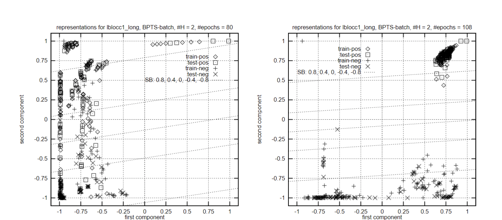

私たちは、少なくともセクション3で提示された一連の分類問題において、我々の手法が既知の手法よりも本当に優れていることを示しました。これらの分類タスクは、事前にその本質に関する知識がある場合、アドホックなシンボリック手続きによって簡単に解決されますが、正と負の例のセットしか与えられていない場合、その本質を導き出すのは非常に困難です。私たちは、私たちが扱っている分類問題は、同等のパフォーマンスを持つシンボリック学習手法では解決できないと確信しています。したがって、論理指向の学習をクラシカルなシンボリックAIへの非常に必要な補完と見なし、ハイブリッド（シンボリック/コネクショニスト）システムで使用できると考えています。

> 図4: lbloc1longにおける用語の表現は、80回と108回のトレーニングエポック後に、バッチモードでBPTSによって開発されました。

我々は、実数値、多次元、または構造化出力を扱うことによって問題を複雑にすることが、学習方法やアーキテクチャについてより多くを学ぶ助けになるとは考えていません。我々の用語分類問題は非常に複雑になる可能性があります。さらに、決定不能な用語分類問題さえも容易に構築できることは明らかです。したがって、我々のアーキテクチャの表現力に関する理論的な研究は、構造化出力を考慮せずとも興味深いものとなるかもしれません。さらに、我々は、クラシカルなシンボリックAIによって解決できない問題、例えば我々の用語分類問題の本質を引き出すような問題を解決するために、コネクショニストアプローチを使用する方がより興味深いと考えています。これらの問題を、長年にわたりクラシカルなシンボリック手法で効率的に解決されてきた統一化のような問題に対するアルゴリズムを導き出すための学習方法を使用するよりも興味深いと考えています。

我々は以下の方向で研究を続けたいと考えています。一つには、ネットワークが作成した表現を分析し、ネットワークが行った一般化についてさらに学ぶことを目指しています。さらに、エンコーダー部分や分類器に追加のレイヤーを導入するなど、より複雑なアーキテクチャを試験することも計画しています。もう一つは、実際のアプリケーションからの例で実験を補完する必要があると考えています。我々が現在取り組んでいるアプリケーションは、ハイブリッド推論システムであり、我々の手法は例から検索制御ヒューリスティックスを学ぶために使用されます【GSS95a】。