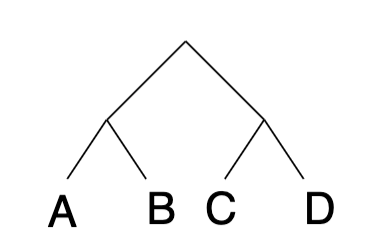
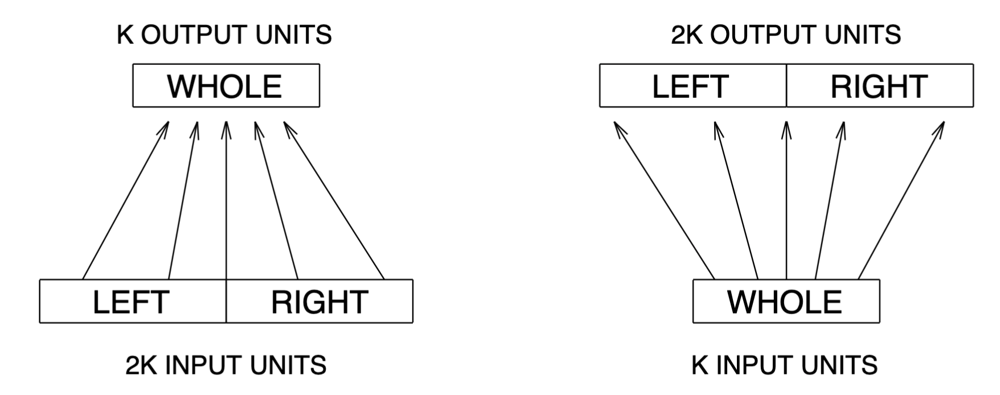
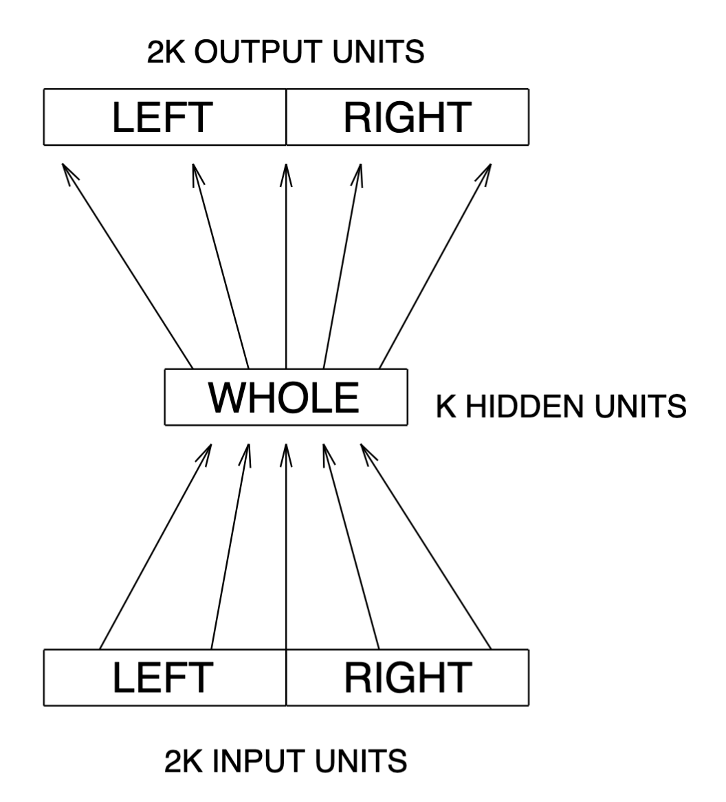
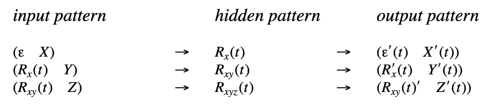
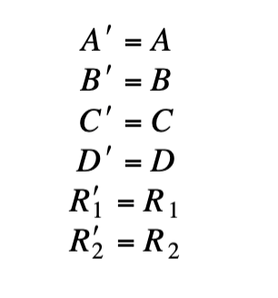
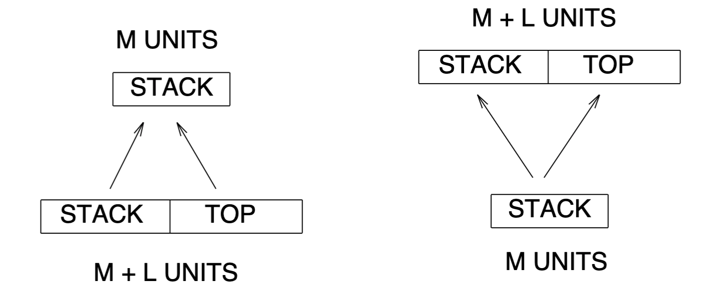

# Recursive Auto-Associative Memory

ここで取り組んでいる問題は、数値的な固定幅形式での可変サイズのシンボリックなシーケンスや木構造の表現です。これは、関連付け、分類、パターン認識、その他のニューラルスタイルの処理メカニズムに適しています。

 
> 図1. 二分木の例

シンボリックな木構造と数値ベクトルを双方向に変換できる仮想的な2つのメカニズムを考えてみましょう。

## (1)圧縮器

圧縮器（Compressor）は、小さな固定幅パターンの集合を同じサイズの単一パターンにエンコードする必要があります。これは、ラベル付き端末（葉）を持つ固定値木に対して、下から上に向かって再帰的に適用でき、木全体を表す固定幅パターンが得られます。図1に示されているように、二分木((A B)(C D))では、各端末が固定幅パターンであり、これには3つのステップが必要です。最初にAとBが圧縮されてパターンR₁になります。次にCとDが圧縮されてパターンR₂になり、最後にR₁とR₂が圧縮されてR₃になります。

## (2)復元器

復元器（Reconstructor）は、これらの固定幅パターンをその部分に復元し、どの部分をさらに復元するべきかを決定します。これも、上から下へ再帰的に適用され、元の木構造を再構築します。したがって、この例では、R₃は R₁'と R₂'にデコードされ、R₁'はA'とB'に、 R₂'はC'とD'にデコードされます。

これらのメカニズムは仮説的なものです。なぜなら、そうした装置を物理的に構築する方法や、計算機的にシミュレーションする方法、あるいは 𝑅𝑖パターンがどのような形をしているかが明確ではないためです。

> 図2. 二分木を扱う圧縮機と復元機のために提案されたフィードフォワードネットワーク。

最初の質問に対する答えとして、これらのメカニズムは、層状で完全に接続されたフィードフォワードネットワークの半線形ユニットという、標準的な現代のコネクショニスト基盤から構築できると仮定しています。

二分木において、葉の部分が𝑘ビットのパターンであれば、圧縮機は2𝑘入力と𝑘出力を持つ単層のネットワークになる可能性があります。

復元機は𝑘入力と2𝑘出力を持つ単層のネットワークになるでしょう。これらの回路図は図2に示されています。

> 図3. 圧縮機と復元機の両方で構成された単一のネットワーク。

第2の質問であるパターンがどのように見えるかに対する答えとして、コネクショニストネットワークに独自の表現を考案させる戦略を開発します。図3に示されているように、これらの2つのメカニズムを同時に1つの2k−k−2kネットワークとして訓練することを考えてみてください。

これはEncoder問題のためのネットワークに非常に似ているように見えます。バックプロパゲーションは、この問題に対してかなり成功を収めており、特に自己教師ありの自己連想モードで3層のネットワークを使用した場合です。ネットワークは一連の入力パターンを再現するように訓練されます。すなわち、入力パターンが望ましい（またはターゲット）パターンとしても使用されます。こうした学習の過程で、ネットワークは各入力パターンに対して隠れ層ユニットに圧縮されたコードを作成します。例えば、8-3-8ネットワークを訓練して8つの1ビット-in-8パターンを再現させると、通常は隠れ層ユニットに3ビットのバイナリコードが生成されます。

しかし、木構造のコードを見つけるためには、この自己連想アーキテクチャは再帰的に使用される必要があります（これが名前の由来です）。前述の単純な例を拡張すると、A、B、C、Dがkビットのパターンであれば、ネットワークは(A B)、(C D)、および((A B)(C D))を次のように再現するように訓練できます。

ここで、t はトレーニングの時間、またはエポックを表します。バックプロパゲーションが極限で収束すると仮定すると、望ましい出力と実際の出力の差の二乗の和は 0 に近づき、次のようになります：

したがって、実際に 𝑅3は木構造 ((𝐴𝐵)(𝐶𝐷))の表現となります。

これは、コンプレッサーが木構造をその表現に変換する決定的なアルゴリズムであり、リコンストラクターがその表現を再び木構造に変換する決定的なアルゴリズムであるという事実によります。

この過程で、すべての部分木、具体的には(𝐴𝐵)と(𝐶𝐷)の表現も生成されます。

後に示すように、この戦略は単一の木構造だけでなく、木構造の集合にも同様に機能することに注意してください。

理論と実践をつなぐいくつかの詳細があります。

（１）初期状態ではランダムである隠れ層のユニット𝑅𝑖(𝑡)の値が、トレーニング環境の一部として使用されます。そのため、ネットワーク内の重みが進化するにつれて、トレーニング環境を構成するパターンのいくつかも変化します。このような非定常的な、または「動くターゲット」の学習形式は、他の研究者によっても探求されています【29,30】。ネットワークの安定性と収束性は、学習パラメータに依存します。Rumelhartら【12, p. 330】による説明に従い、学習率𝜂とモメンタム𝛼の2つのパラメータが存在します。学習率 𝜂は勾配降下のステップサイズを制御し、モメンタム𝛼は前のステップの影響を統合します。これらのパラメータは、隠れ層の表現の変化が重みの変化によってもたらされる誤差の減少を無効にしない程度に低く設定され、また実際に変化が生じる程度には十分高く設定される必要があります。本論文で後述される実験では、学習率𝜂は通常0.1（より大きな実験ではそれ以下）に設定され、モメンタム𝛼は0.3に設定されました。学習曲線が平坦になると、モメンタム𝛼は0.9まで徐々に増加されます【31】。

（２）学習における帰納法は機械的な枠組みの外にあります。この帰納法は、局所的な改善のみから生じるグローバルな成功と類似しており、分類システムで使用されるバケット・ブリゲードの原理【32】に似ています。トレーニング戦略では、𝑅1′や𝑅2′から端末を再構築することはなく、それらが等しいという事実のみが、𝑅1や𝑅2がこの戦略を機能させるために必要です。しかし、バックプロパゲーションは永遠に実行することはできません。そのため、少なくとも標準的なシグモイド活性化関数を使用している場合、前述の完全なエンコーディングを達成することは不可能です。そのため、トレーニングをいつ終了するかを判断するための現実的な方法が必要になります。バックプロパゲーションがバイナリ出力を生成するために使用される場合、通常は許容範囲 τ が 0.2 に設定されており、すべてのトレーニングパターンのすべての出力値が目標値のビットの許容範囲内にある場合にトレーニングを終了できます。しかし、バイナリでない非終端パターンに対しては、20%の許容範囲はあまりにも緩すぎます。例えば、R1 を正常に再構築するためには、R1' は R1 に非常に近くなければなりません。そのため、2 番目の許容範囲 ν が導入されます。実験では、非終端の実数値パターンに対して、この許容範囲 ν は 0.05 に設定されています。

(3) このアーキテクチャの名前である「Recursive Auto-Associative Memory (RAAM)」は、オートアソシアティブメモリによって生成されたコードがさらに圧縮されることを正確に反映しています。しかし、実際には同時に訓練される2つの独立したメカニズムが存在することを反映しているわけではありません。これらのメカニズムには、制御とメモリの形でいくらかのサポートが必要ですが、閾値を使用する単純なニューラルネットワークの能力を超えるものではありません。木を下から上へエンコードするためには、コンプレッサーには一時的な結果を保存するためのスタック（例えば R1 など）が必要です。逆に、木を上から下へデコードするためには、リコンストラクターにも中間パターンを保存するための外部スタックが必要です。さらに、端末テストを実行するためのメカニズムが必要です。以下の実験では、この端末テストは単に「バイナリ性」をテストするための閾値テストであり、パターンのすべての値が 1−τ より上か、τ 以下であることを確認します。あるいは、単純な分類器を訓練するか、集合への所属をテストするための従来のコンピュータプログラムを使用するか、エラー検出と修正を行うことができます。

## 2.1. Sequential RAAM

シーケンス（例えば、(X Y Z)）は、左枝分かれの二分木、すなわち ((NIL X) Y) Z） として表現できるため、RAAMアーキテクチャの別バージョンは、シーケンスの表現および後入れ先出し（LIFO）アクセスメカニズムの開発に適しています。

>単層ネットワークにおける逆シーケンシングメカニズム。

>圧縮機は、シーケンス（STACK）のためのm次元表現と新しい要素（TOP）を結合し、新たなm次元ベクトルを返します。再構成機はそれを元の要素にデコードします。

このアーキテクチャは、実際には木構造のメカニズムよりもシンプルです。圧縮された表現は一方に再循環されるだけでよく、外部に保存する必要があります。また、表現のサイズに対する制約も少なく、終端記号𝐿に対して、圧縮されたパターンに高次元の𝑀を割り当てることができます。

図4は、逐次RAAMのための単層圧縮器と再構成器のネットワークを示しています。このネットワークを単一のネットワークとして見ると、入力と出力のユニットは𝑀+𝐿あり、隠れユニットは𝑀です。

数値の𝑀-ベクトルである𝜀は、空のシーケンス（NIL）を表すと仮定されます。

以下の実験では、すべての値が0.5であるベクトルが選ばれていますが、これが中間状態として生成される可能性は非常に低いです。

前述の論理に従い、このネットワークが次のパターンでトレーニングされた場合、...

逆伝播が収束すると、𝑅𝑥𝑦𝑧はシーケンス (X Y Z) の表現となることが期待されます。

その途中で、シーケンスのすべての接頭辞、つまりこの場合は (X) と (X Y) に対する表現も生成されることになります。