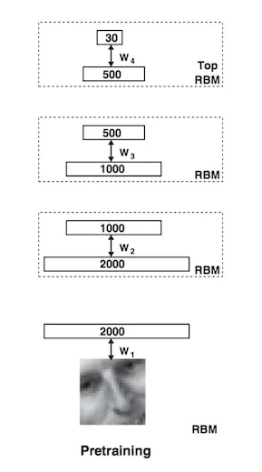
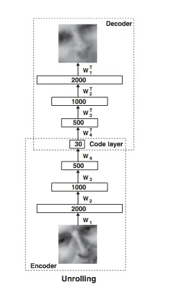
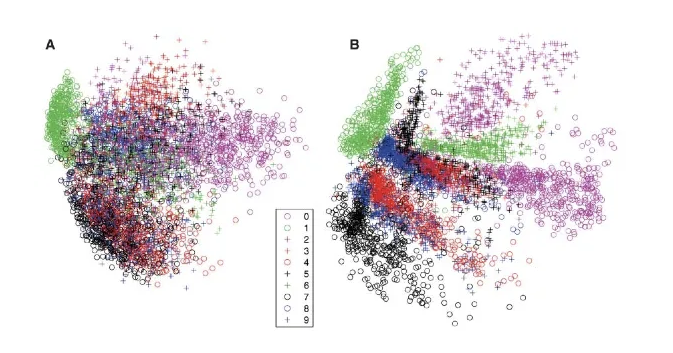

この論文はディープラーニングにおける画期的な論文であり、ニューラルネットワークの事前トレーニングについて独自の洞察を提供します。

この論文の結果に関連するコードとデータセットは[こちら](https://www.cs.toronto.edu/~hinton/MatlabForSciencePaper.html)から入手できます。

# Overview

この論文は2006年にScience誌に掲載され、それ以来、ディープニューラルネットワークの研究に爆発的な広がりをもたらしました。

この研究の目的は、ディープニューラルネットワーク（通常3層以上の隠れ層を持つものがディープと見なされます）を用いて入力の次元を削減することでした。

ディープネットワークのトレーニングは、ラベル付きトレーニングデータの不足、コンピュータ速度、非局所的最適解（これらすべてが後に誤りであると判明しました）などの理由で非常に困難であると考えられていました。

この論文では、紹介されている次元削減技術が主成分分析（PCA）やロジスティックPCAと比較されています。この論文の結果は、次元削減、特徴学習、およびニューラルネットワークの使用において驚異的なブレークスルーを示しています。

# Methods

G. E. Hintonは、層ごとの貪欲な事前トレーニングを通じて大規模ニューラルネットワークをトレーニングするための方法論を提案しました。

彼のアプローチでは、例えば50x50ピクセルの画像を入力として取り、それを特徴空間に圧縮するために制限ボルツマンマシン（RBM）をトレーニングしました。

モデルの第1層は入力、つまりこの場合は画像となります。第2層以降は隠れ層となり、入力画像を低次元で表現します。各セットの重みは個別に学習されるため、最初のステップでW1が学習され、W1が学習されると、データは最初の転送結果としてすべて保存され、その後W2が学習される、というプロセスが続きます。RBMのトレーニングに関する実用ガイドは

[こちら](https://www.cs.toronto.edu/~hinton/absps/guideTR.pdf)(PDF)から入手できます。

制限ボルツマンマシン（RBM）は生成モデルであり、重みは双方向です。これは、2層目の活性化が1層目の対応する活性化セットを生成するために使用できることを意味します。ヒントンはこの原理を利用し、スタックされたボルツマンマシンをニューラルネットワークに「展開」しました。層間の重みは、データを元の次元にマッピングするために実質的に再利用されます。このプロセスは、ニューラルネットワークの入力重みとして使用され、バックプロパゲーションを用いて、出力としての入力重みを使用して重みを微調整できます。「コード層」の重みは、その後、分類、回帰、クラスタリング、検索などに使用できます。

# Results

この次元削減の結果は、論文内で主成分分析（PCA）と質的および量的に比較されています。違いを示すために、ここに1つの例が維持されています。Aは標準的なPCAの2次元結果を示し、Bはディープニューラルネットワークの結果を示しています。この例から明らかなように、オートエンコーダと呼ばれるものは、2次元空間に投影されたとき、PCAよりもはるかに明確な数字の分離を生成します。これはおそらく、オートエンコーダが非線形特徴を学習する能力を持っているためです。各層には非線形活性化ユニットがあり、より複雑な入力の表現を学習することができるからです。貪欲な層ごとのトレーニング結果の詳細な例については、論文を参照してください。

# Analysis