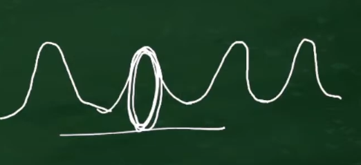
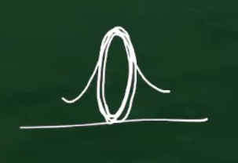
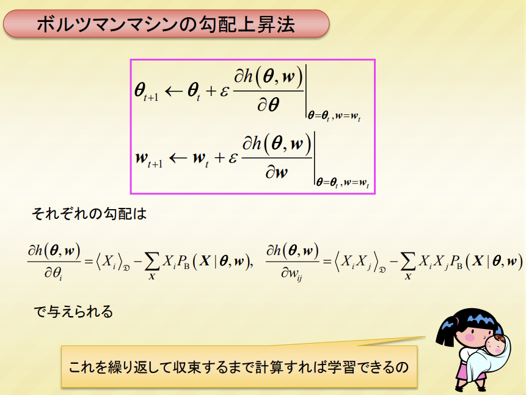
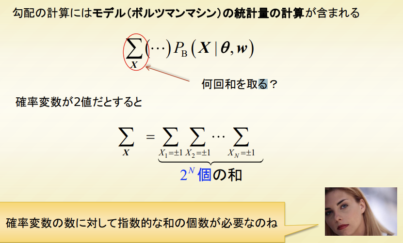
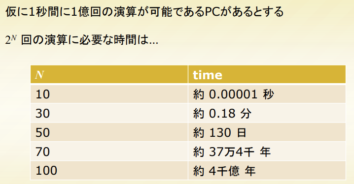

# 1.はじめに

Boltzmannmachineは 1980年代に提案されたニューラルネットワーク由来の相互結合型機械学習モデルであり，マルコフ確率場と呼ばれる応用上非常に重要なモデルクラスに属する統計的機械学習のモデルである。

ボルツマンマシは一般に複数のピークをもつ分布になり得るため，比較的複雑なデータ構造に対応可能である。

ガウス分布やベルヌーイ分布は、ピークを一つしか持たない。

すなわち、犬の画像を生成する場合、ある一般的な一種類の犬の画像のみしか生成できない。

ところがボルツマンマシンは一つの重大な問題を抱えているためにこれまで積極的な利用が避けられてきた。

その問題とは計算量の問題である．ボルツマンマシンの学習あるいはボルツマンマシンを利用した確率的推論を実行するためには非現実的な計算時間を要してしまい，その面であまり実用的とは考えられてこなかった。

以下では、尤度関数を最大化、すなわち極値を見つけるために、勾配上昇法を使用した例を挙げる。

上記におけるNとは？

難しく言うと、バイナリ変数の数、すなわち確率分布の次元。

観測データとして白黒の2値画像の例を考える。

白が＋ 1で黒が一 1に対応すると、

各ピクセルの値　＝　$X_i = (-1) or (+1) $

N = ピクセルの数

しかし，ここ十数年でその状況はかなり変化してきた．2000年代初頭に制限ボルツマンマシンと呼ばれるボルツマンマシンモデルの再発掘とそれに対するCD法と呼ばれる効果的な近似学習アルゴリズムの提案がなされ，それらが最近話題となっている深層学習 (deeplearning) の概念へとつながった [Hinton06]．深層学習のモデルは現在さまざまな応用課題において目覚ましい成果をあげてきている。

# 2.統計的機械学習理論ーデータ生成モデルの再現

ある n 次元の {+1, -1} の 2 値の観測データ点があったとする。
そのデータ点を 

$
x = \{x_1, x_2, …, x_n\} = \{x_i | i = 1, 2, …, n\} 
$

と表す。

データは通常確実なもの（完全に予想できるもの）ではなく、次にどのようなデータを受け取るかわからないといったような不確実性をもつ。

ここでいうパターンとは **[x1 が +1 で d2 が -1 で…]** というように観測されたデータ **x** の値の一つの集まりのことを指す。

不確実性をもつため、データは確率的に出現するものと考える。

そしてデータはある n 次元の確率分布 **Pg(X)** から生成されたものと考える。ここで **X = {Xi ∈ {+1, -1} | i = 1, 2, …, n}** は n 次元の確率変数である。

つまり確率分布 **Pg(X)** に従ってサンプルされた一つの実現値が **x** という解釈である（確率変数 **Xi** に対応するサンプル点が **xi** であると考えている）。 

**Pg(X)** は対象のデータの確率的な生成規則を規定するものであるから、 **Pg(X)** をデータの生成モデル（**generative model**）と呼ばれる。

データパターンには出現しやすいものやそうでないものがあるであろうから、データパターンごとに出現確率は異なるであろう。

そのデータパターンごとの出現確率を記述するのが生成モデルである。

観測データとして、図1に示したような白黒の2値画像の例を感がセル。

白が＋１で黒がー１に対応するとして、各画像中の各ピクセルの色をデータとすると、データは画像の全画素数の次元となり、一つのデータパターン**x**がある一つの白黒画像となる。

その場合、**Pg(x)**は与えられた白黒画像のデータ**x**の生成確率を表す。（例えば，図 1の一番左の画像が出現する確率は00％など，画像ごとの出現確率を表す）

データが生成モデルに従い発生しているので， もし生成モデルの詳細がわかれば，そのデータの（確率的）生成メカニズムは完全に掌握できるはずである． 

しかし残念ながら，（当たり前ではあるが）現実のデータに対する生成モデルは一般には未知の分布である．

データを生成している未知の生成モデルを再現することが統計的機械学習理論の目的であり，受け取った観測データのセットを利用して生成モデルを構築するための
枠組みを与えるための理論枠組みである．図 2に統計的
機械学習理論のスキームを示す．未知の生成モデルから
その確率に従ってデータが生成されているとする