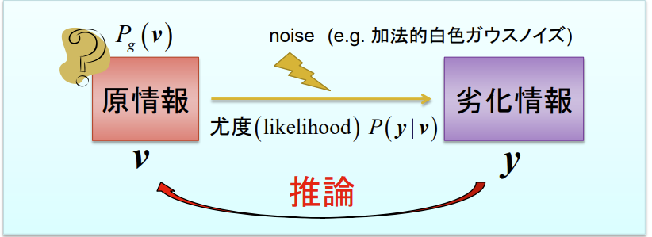
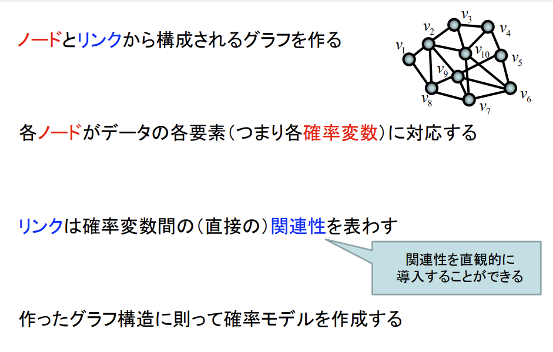

# 統計的機械学習

## (1)決定論的ニューラルネットワークと、統計的機械学習の違い

### 決定論的ニューラルネットワークによる機械学習

入出力関係をデータから学習する

入力と出力の決定論的な（入力から出力が一意に決まる）

関数関係を探し出すのが目的

### 統計的機械学習

データの確率的な生成規則を学習する。

データパターンを生成する背景となっている確率分布を探し出すのが目的

要はデータからシステムの真の構造を抽出したい

- データのヒストグラムをとれば一発じゃない？

確かにデータが超たくさんあればそれも悪くない

でも，十分なヒストグラムを作ろうとした場合，問題が高次元になるほど必要なデー
タ数が（指数的に）膨大になっていき，現実的にはかなり難しくなってくる
（次元の呪い）

高次元空間でデータの単純なヒストグラムはいたるところスカスカ

このスカスカなヒストグラムを参考にしながら背後にある確率規則を見つけ出すということをしなくてはならない

これは実際には不良設定問題なので正確な解法はありません

そこで，一つ仮定をおきます

「背後に潜むホントの確率分布はある程度滑らか」であると仮定します

## (2)なぜ確率を使うのか？

データパターンは取らる確率規則に従って発生しているとする。

なぜ確率が必要？

- 観測ノイズにかかわる不可避の不確実性

- 知識不足による未知の因果にたいする不確実性

- データの生成プロセスの不確実性

不確実な現象を表現する数学＝確率理論

あいまいさを含むシステムに対しては確率的表現が本質的である。

## (3)ベイズ的確率推論

原情報 v が通信路ノイズによって劣化し

劣化情報 y に変化した

我々は y しか知らない

「尤度（likelihood）𝑃(𝑦∣𝑣)」は、与えられた原情報 𝑣に対して、劣化情報が観測される確率を表しています。

具体的には、これはノイズ（例えば加法的な白色ガウスノイズ）が影響を与えた結果として、観測されるデータ𝑦が生成される確率のことです。

    我々は y しか知らない

    ⬇️

    y から v を推定したい！

## (4)事後確率を計算する

事後確率P(v|y)とは、yを知った上でのvの確率であり、ベイズの公式を用いると...

時間的には、

（事後確率）＝P（v|y）=P(原因|結果)

ベイズの公式とは、結果から原因を探るための定式化

### (5)最大事後確率（MAP）推定

yから見て確率的に最もありえそうなｖが原情報だろうと考える

＝ベイズ的確率推定の基礎

### (6)事後確率計算に必要なもの

## (7)事前確率（生成モデル）

## (8)観測データのセットD

## (9)統計的機械学習の枠組み

## (10)統計的機械学習とベイズ的確率推論

## (11)残された課題

生成モデルを近似する学習モデルを仮定するひつようがある

どのようなモデルを仮定する？？

もちろん課題によって設計されるべきだが、

グラフィカルモデルは中でも割と一般的に使える可能な選択肢の一つ

# グラフィカルモデル

## (1)データをどう考えるか？

（生成モデル）　＝　（データの確率的生成規則を記述する）

この場合のデータは普通多次元（e.g.画像ならピクセル個数分の次元）

- データというものはふつう独立的ではなく，データ要素間に何らかの関連性（確
率的相関構造） をもつ
→ 出現しやすいデータパターンや出現しにくいパターンが存在する
（A家の夕食がカレーのときは何故かB家の夕食が煮物であることが多い etc）

- データを確率的に扱うだけでなく，そのような関連性も扱うことが重要

## (2)生成モデルは確率的相関構造を持つ

生成モデルはデータ要素間に関連性を持たせるべきである

＝データ要素間の確率的関連性を明に取り入れるモデリング

- マルコフ確率場(MRF)

- ベイジアンネットワーク(BN)

ともにグラフィカルモデルと呼ばれる。

## (3)グラフィカルモデル？？

- MRF : 無向グラフ上の確率モデル

- BN : 有向（非循環）グラフ上の確率モデル

## (4)マルコフ確率場の導入

### $ \Phi_i(v_i) $ の意味
- **ノードポテンシャル（Node Potential）**: $ \Phi_i(v_i) $ は、グラフの各ノード $ v_i $ に対して定義されるコストまたはエネルギーを表しています。これは、ノード自体の状態に依存する値であり、特定のノード $ v_i $ が特定の状態にあるときにかかる「コスト」として解釈できます。

### $ \Psi_{i,j}(v_i, v_j) $ の意味
- **エッジポテンシャル（Edge Potential）**: $ \Psi_{i,j}(v_i, v_j) $ は、隣接するノード $ v_i $ と $ v_j $ の組み合わせに対して定義されるコストまたはエネルギーを表しています。これは、ノード $ v_i $ と $ v_j $ がそれぞれ特定の状態にあるときにかかる「コスト」を示します。この値は、ノード間の相互作用や関係性を反映しています。

### エネルギー関数 $ C(v) $ の意味

エネルギー関数 $ C(v) $ は、全体のシステムのエネルギーを計算するための関数であり、次のようにノードポテンシャルとエッジポテンシャルの合計として定義されます。

$$
C(v) = -\sum_{i \in V} \Phi_i(v_i) - \sum_{\{i,j\} \in E} \Psi_{\{i,j\}}(v_i, v_j)
$$

ここで、各ノード $ v_i $ に対するコストと、リンク（エッジ）に対するコストの合計が全体のエネルギーとなります。このエネルギーを最小化するような状態を見つけることが、通常、マルコフ確率場における推論タスクの目的となります。

# ボルツマンマシン

## (1)ボルツマンマシンとは？

- もっとも基礎的な MRF

- 連想記憶モデルであるホップフィールドモデルの確率的拡張モデル

-  相互結合型の確率的ニューラルネットワーク

- 最近のディープラーニング（深層学習）ブームで再燃焼