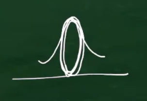

最尤推定とは、最小二乗法、モーメント法のよう未知のパラメータの推定方法の一つである。

最尤法では尤度関数と呼ばれる目的関数を最大化する未知パラメーターの値を推定量(値)とする。

尤度関数は観測された確率変数が離散型か連続型かで定義がやや異なる。

## (0)大まかな説明

今回は正規分布を用いた例を考えます。

尤度推定とは、観測されたデータから、元の確率分布のパラメータを推定することです。

たとえば、正規分布の場合は、

$$
{
    f(x)={1 \over \sqrt{2\pi\sigma^{2}}} \exp \left(-{1 \over 2}{(x-\mu)^2 \over \sigma^2} \right)
}
$$

となり、グラフは以下のようになります。

正規分布は二つのパラメータ平均μと、標準偏差σを持ち、これを、観測されたデータから推定します。

「10個の標本がこの値となった同時分布」をまず考えていきます。
また、この10個の標本はi.i.d.（独立同一分布：同じ分布から独立に取られた標本）であると仮定します。

１０個の標本が同時に観測された値になる確率、すなわち結合確率は、独立なのでそれぞれの確率密度の積として表せるので、

$$
{
    P(x_1, x_2,\cdots,x_{10}) = P(x_1)P(x_2)\cdots P(x_{10}) 
}
$$

となります。

ここでは全て正規分布としていたので、$P(x_i)$ はすべて正規分布としていたので、

$$
{
    P(x_1, x_2,\cdots,x_{10}) = f(x_1)f(x_2)\cdots f(x_{10}) 
}
$$

としてもいいですね。これをさらに展開して書くと

$$
{
    (x_1, x_2,\cdots,x_{10}) = \prod_{i=1}^{10} {1 \over \sqrt{2\pi\sigma^{2}}} \exp \left(-{1 \over 2}{(x_i-\mu)^2 \over \sigma^2} \right)
}
$$
です。

これで標本10個の同時確率密度関数ができました。

しかしちょっと待ってください。いま標本は実現値として持っているのでもはや不確定な確率的な値ではありません。確定値です。むしろ分かっていないのは平均μと標準偏差σの２つのパラメーターでした。

なので、観測データ $ x_i $ は定数と考え、推定する二つの値μと、σが変数であると言う風に発想を転換します。

関数の形は全く同じで、変数をμ、σ、であると宣言し直したものを尤度(Likelihood)と定義し

$$
{
    L(\mu, \sigma) = \prod_{i=1}^{10} {1 \over \sqrt{2\pi\sigma^{2}}} \exp \left(-{1 \over 2}{(x_i-\mu)^2 \over \sigma^2} \right)
}
$$

となる。

上の式は、平均と標準偏差がとある値μ、σのときの、観測されたデータの発生のしやすさ、すなわち確率を出力する。

よって、尤度Lを最大化するということは、観測されたデータが最も発生しやすい、分布のパラメータをもとめることです。

## (1)離散型確率変数

1. サイコロの目:
サイコロを振って出る目の数は、1から6の整数値をとります。これは典型的な離散型確率変数です。各目が出る確率は1/6です。

2. コインの裏表:
コインを投げた結果が「表」か「裏」かは、離散的な二つの値（表=1、裏=0など）をとる確率変数です。表が出る確率が 
𝑝で、裏が出る確率が 1−𝑝です。

3. 複数選択問題の得点:
ある複数選択問題で、得点が 0 点、1 点、2 点のいずれかになる場合、それぞれの得点は離散型確率変数に該当します。

離散型の確率変数についての尤度関数の定義を述べる。今、$ X_i, i=1,\dots,n $ は離散型確率変数で、その**同時（結合）確率関数**は未知パラメータベクトル $ \theta $ に依存しており、

$$
f(x_1, x_2, \dots, x_n; \theta)
$$

で与えられるとする。

$ X_i, i=1,\dots,n $ の値が与えられた時、$ f(\dots; \theta) $ を $\theta$ の関数とみなしたものを

$$
L(\theta) = f(x_1, x_2, \dots, x_n; \theta)
$$

と表すとする。この $ \theta $ に関する関数 $ L(\theta) $  が**尤度関数**である。

つまり（離散型確率変数の場合）尤度関数とは**同時確率関数を未知パラメータの関数とみなしたもの**である。

## (2)連続型確率変数の例

1. 人の身長:
人の身長は、特定の範囲内で任意の実数値をとることができます。これは連続型確率変数の典型的な例であり、通常は正規分布などでモデル化されます。

2. 温度:
一日の温度の測定値は、連続した値をとる確率変数です。例えば、ある時間帯の温度が20.5度や21.3度といったように、非常に細かい値をとることができます。

3. 株価:
株価の終値なども連続型の確率変数に該当します。株価は特定の範囲内で小数点以下の値を含む任意の数値をとることができます。

## (3)i.i.d確率変数の場合

i.i.d確率変数というのは「独立同分布」の略で、確率変数 $ X_i $ は他の確率変数とは独立しており、さらにすべての $ X_i $ は同じ確率分布に従います。

確率分布は既知であるが、1つの母集団（パラメータ $\theta$）が未知なる母集団を考える。

このとき確率分布は $ \theta $ に依存する関数とも考えられ、これを $ f(x; \theta) $ で表すことにする。

この母集団から独立に $ n $ 個の標本を抽出したときのデータ $ x_1, x_2, \dots, x_n $ は、i.i.d.確率変数である。

例）

（１）サイコロを何度も振る場合:

サイコロを振って出る目の数は、各回が独立であり、かつ同じ1から6の離散的な一様分布に従うため、これらはi.i.d.確率変数の例です。

（２）コイン投げの繰り返し:

同じコインを何度も投げた結果（表か裏）は、独立しており、かつ同じ二項分布に従うため、i.i.d.確率変数の典型的な例です。

### 同時確率（密度）関数
同時確率（密度）関数 $ f(X_1, X_2, \dots, X_n) $ は、すべての確率変数 $ X_1, X_2, \dots, X_n $ が同時に特定の値を取る確率を表します。

### 周辺確率（密度）関数
一方、周辺確率（密度）関数 $ f(X_i) $ は、個々の確率変数 $ X_i $ が特定の値を取る確率を表します。

### i.i.d. の特性と積の関係
i.i.d. の特性により、すべての確率変数 $ X_i $ は独立しているため、ある $ X_i $ が特定の値を取ることが他の $ X_j $ に影響を与えません。

このため、同時確率（密度）関数 $ f(X_1, X_2, \dots, X_n) $ は、各 $ X_i $ の周辺確率（密度）関数の積として表すことができます。数式で表すと、次のようになります：

$$
f(X_1, X_2, \dots, X_n) = f(X_1) \cdot f(X_2) \cdots f(X_n) = \prod_{i=1}^{n} f(X_i)
$$

### サイコロの例

サイコロを3回振る場合、それぞれのサイコロの目（$ X_1 $, $ X_2 $, $ X_3 $）が独立で同じ確率分布（1/6の確率で1から6の値を取る）に従います。このとき、サイコロの目がそれぞれ「3、5、2」と出る確率は、各サイコロの目が独立であるため、それぞれの確率の積として計算できます：

$$
P(X_1 = 3, X_2 = 5, X_3 = 2) = P(X_1 = 3) \times P(X_2 = 5) \times P(X_3 = 2) = \frac{1}{6} \times \frac{1}{6} \times \frac{1}{6} = \frac{1}{216}
$$

### i.i.d.確率変数の尤度関数

確率変数 $ X_i $, $ i=1, \dots, n $ が i.i.d. 確率変数の場合、同時確率（密度）関数は周辺確率（密度）関数の**積**となるので、尤度関数は

$$
L(\theta) = f(x_1; \theta) f(x_2; \theta) \dots f(x_n; \theta)
$$

となる。ここで $ f(x_i; \theta) $ は $ X_i $ の周辺確率（密度）関数であり、関数形 $ f(\cdot; \theta) $ は全ての $ X_i $ について共通である（同分布なので）。

## (4)対数尤度関数

最尤法による推定では尤度関数を最大にする未知パラメーターの値を見つける必要がある。
この時、尤度関数をそのまま最大化するよりも、尤度関数の対数を取ったものを最大化する方が計算が簡単になる。

尤度関数の対数をとったものは対数尤度関数と呼ばれる。

対数変換は単調増加変換なので、尤度関数を最大にするパラメータの値は対数尤度関数を最大化するパラメーターの値と一致する。

ガウス分布やベルヌーイ分布は、以下のような形になる。

また、混合ガウス分布は以下のような形なる。

確率分布は既知であるが、1つの母数（パラメータ $ \theta $）が未知なる母集団を考える。

このとき確率分布は $ \theta $ に依存する関数とも考えられ、これを $ f(x; \theta) $ (xが出力される確率)で表すことにする。

この母集団から独立に $ n $ 個の標本を抽出したときのデータが $ x_1, x_2, \dots, x_n $ の値をとる確率すなわち、尤度は

$$
L(\theta) = f(x_1; \theta) \cdot f(x_2; \theta) \cdots f(x_n; \theta) = \prod_{i=1}^{n} f(x_i; \theta)
$$

となる。

上記の二つの確率分布に注目してほしい。

山の頂上付近の値ほど、出力される可能性が高い

＝尤度関数も大きくなる

すなわち、尤度関数を最大化するパラメータにおいて、尤度関数は極値をとる。

よって、尤度関数をパラメータで微分し、その値が０になればよい。
