# 統計的機械学習

## NNによる機械学習と統計的機械学習の違い

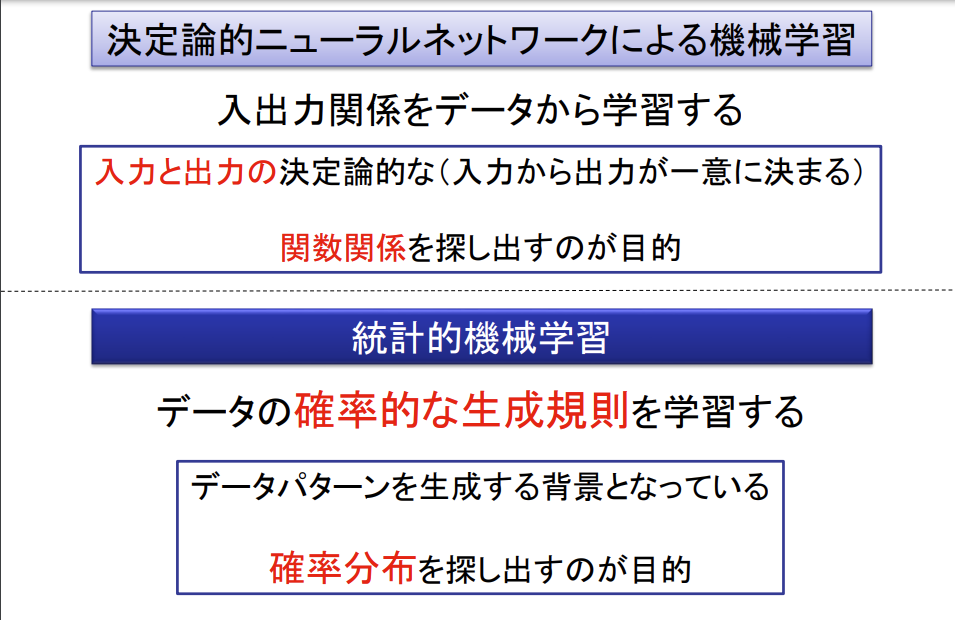

## なぜ確率を使うの？？？

データパターンはとある確率規則 $ P_g(v) $ に従って発生しているとする。

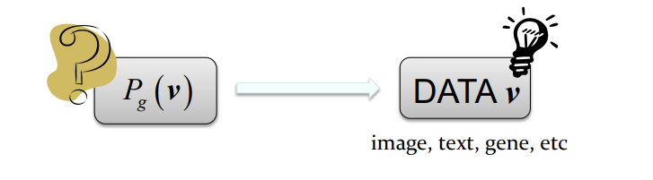

なぜ確率が必要なのか？

- 観測ノイズに関わる不可避の不確実性

- 知識不足による未知の因果に対する不確実性

- データの生成プロセスの不確実性

あいまいさを含むシステムに対しては確率的表現が本質的である。

## 何が目的なの？？

データ生成の背後に隠れている確率規則を見つけ出すこと

要はデータからシステムの真の構造を抽出したい

そんなの例えばデータのヒストグラムを取れば一発じゃない？

確かにデータが超たくさんあればそれも悪くない方法

でも，十分なヒストグラムを作ろうとした場合，問題が高次元になるほど必要なデー
タ数が（指数的に）膨大になっていき，現実的にはかなり難しくなってくる
（次元の呪い）

## ベイズ的確率推論

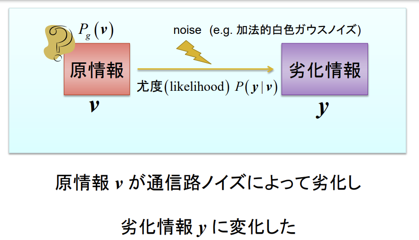

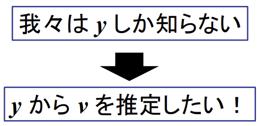

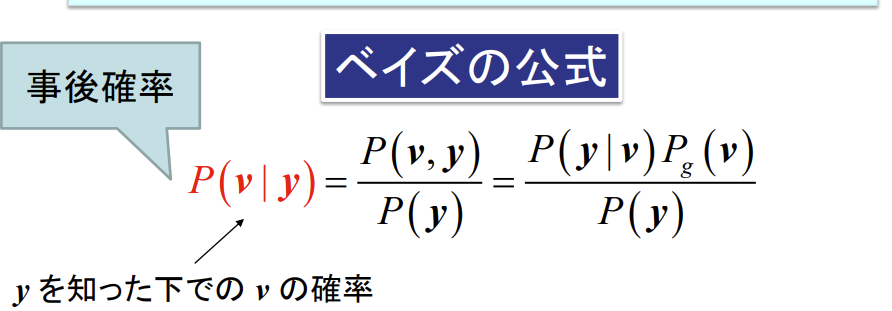

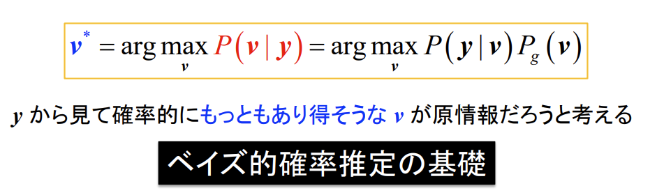

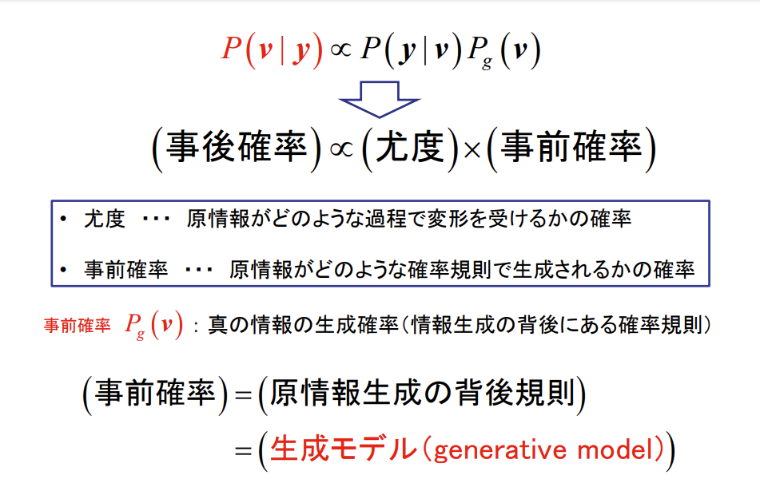

## データセット

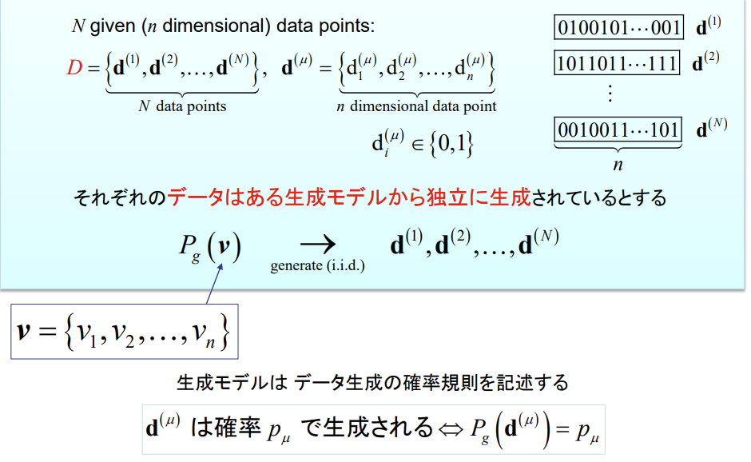

# グラフィカルモデル
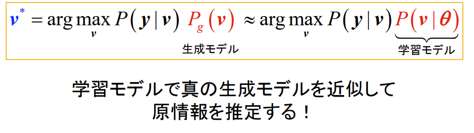

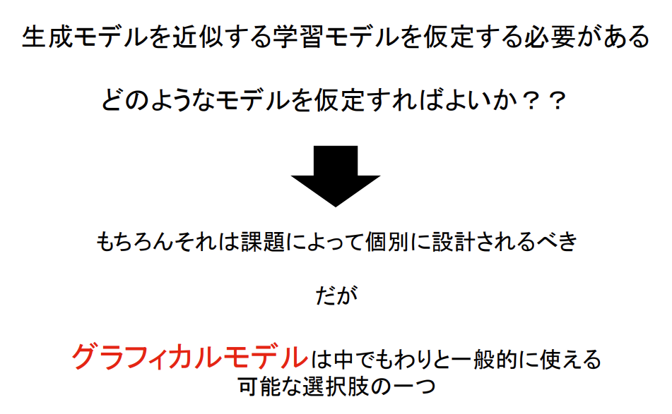

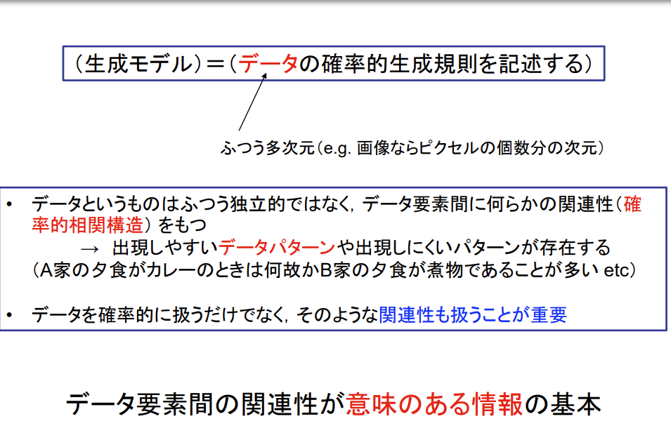

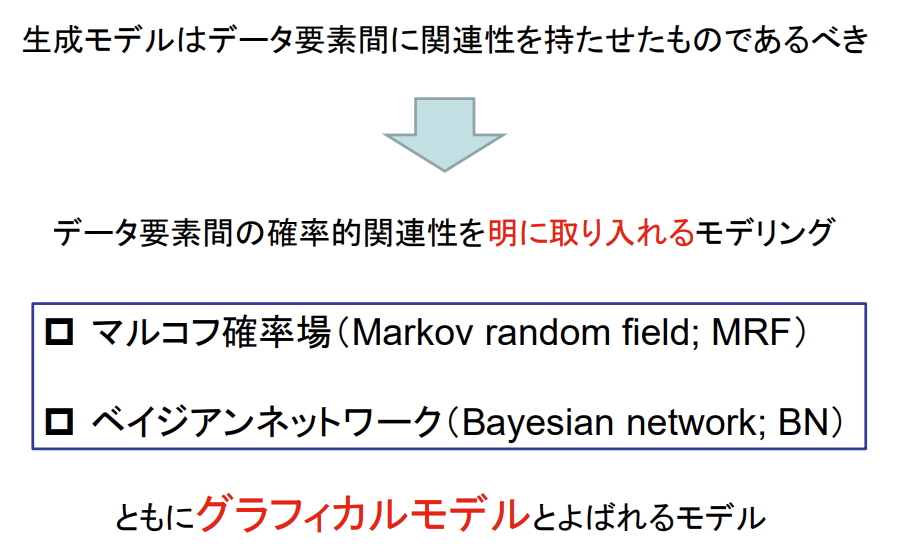

## グラフィカルモデルとは

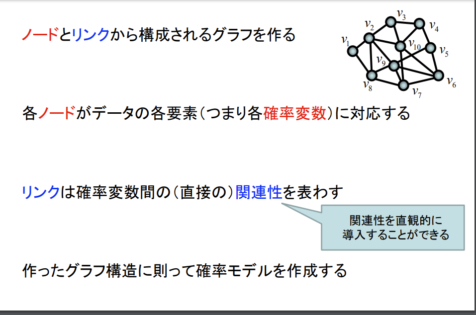

- マルコフ確率場：無向グラフ上の確率モデル

- ベイジアンネットワーク：有向（非循環）グラフ上の確率モデル

## マルコフ確率場の導入

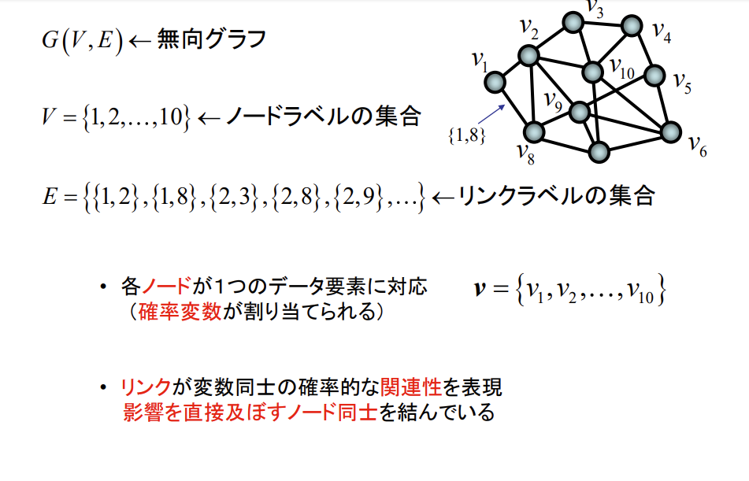

白黒画像に関する生成モデルにおいて， ピクセルは碁盤の目上に並べられているので，各確率変数 $ v_i $ をそれぞれ白 ($ v_i = +1 $) か黒($ v_i= -1 $) になる各ピクセルに対応させると，適当なグラフ構造として下記 のような画像サイズと同じ正
方格子型が一つの選択肢となるだろう。

最も近いピクセル同士は強く依存し合うであろうという仮定をすれば， リンクは最近接のピクセル間のみに存在する。

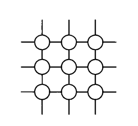

生成モデルを学習する際、何か分布を仮定する必要がある！！！！！

たとえば、....

ガウス分布

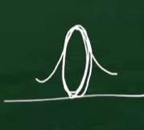

混合ガウス分布

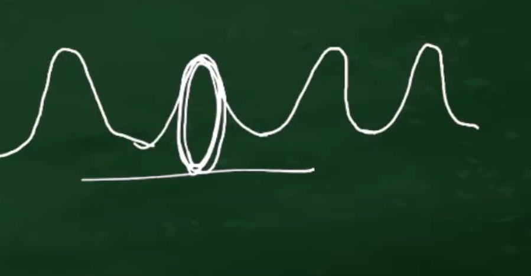

## 今回使用する確率分布に求められる条件

（１）いろいろな形の分布に、パラメータ次第でなることができる

（２）グラフ由来の依存関係を扱うことが出きる

＝ マルコフ確率場

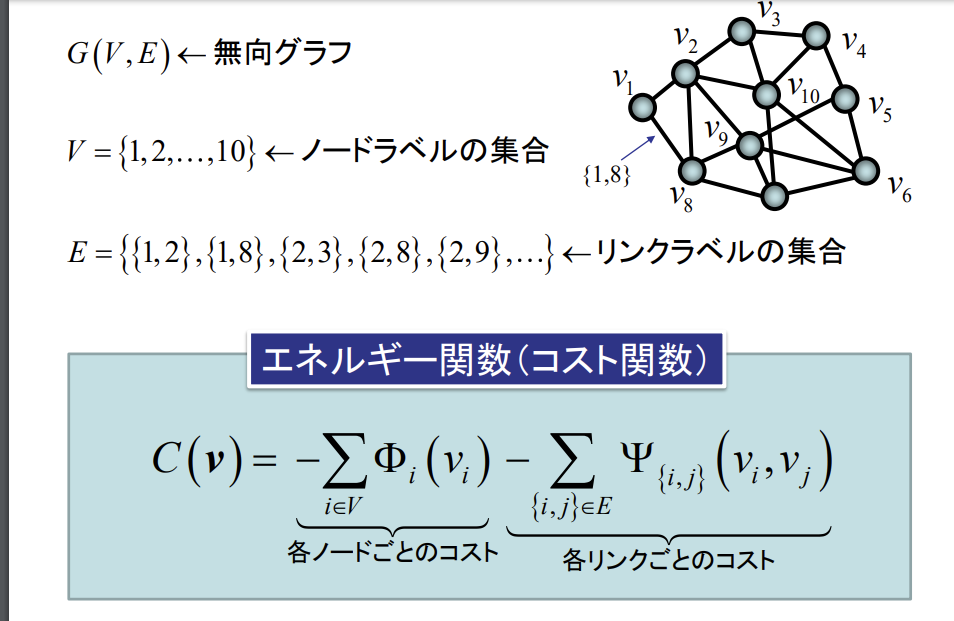

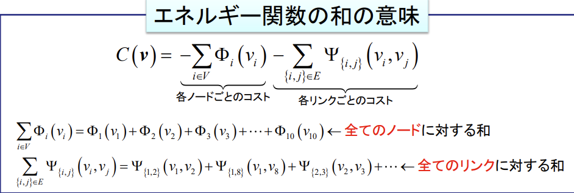

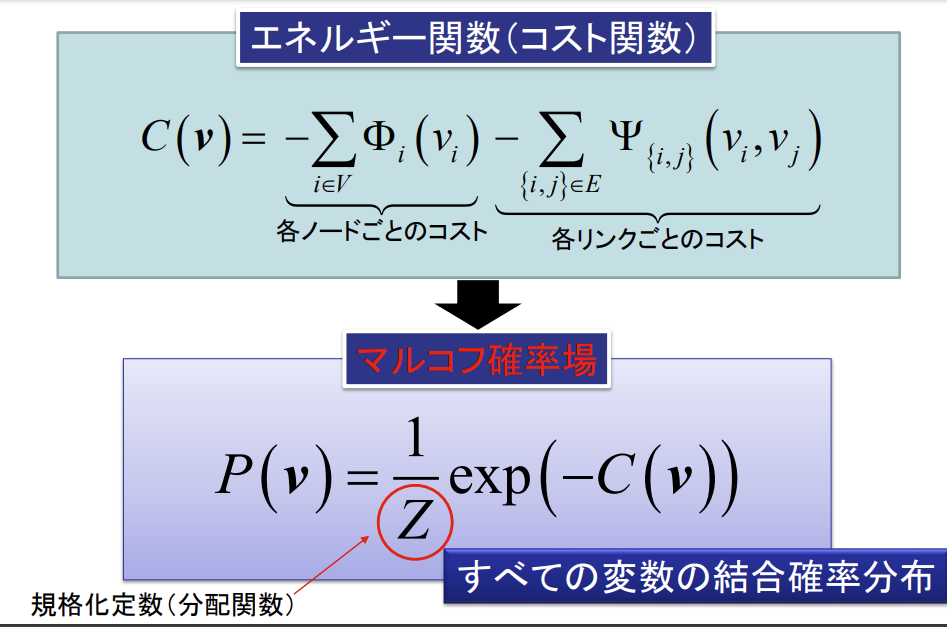

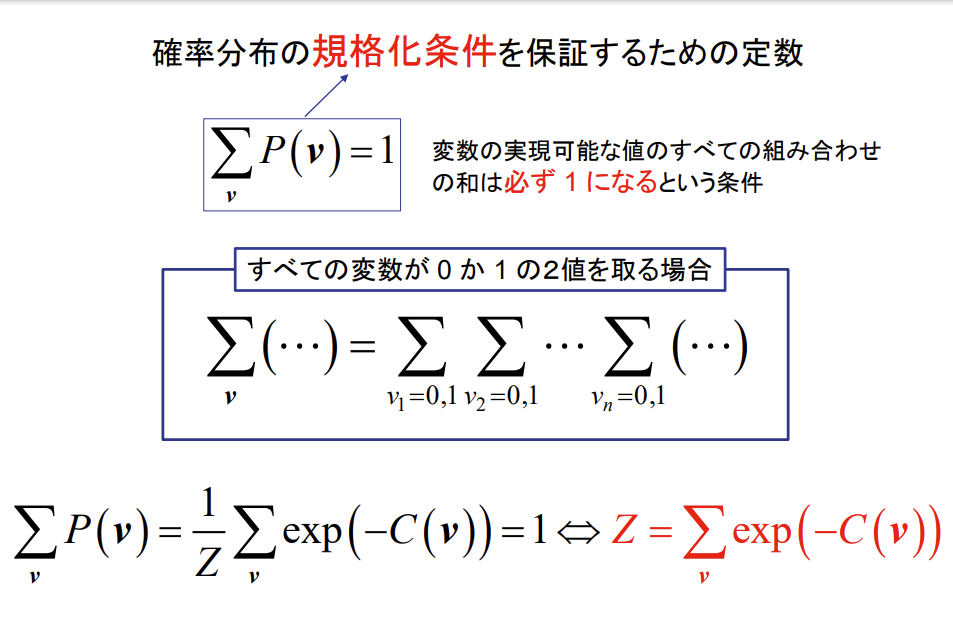

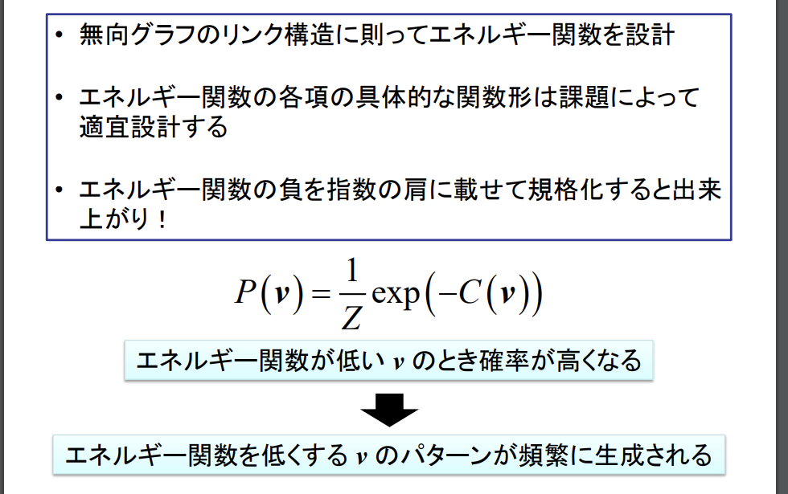

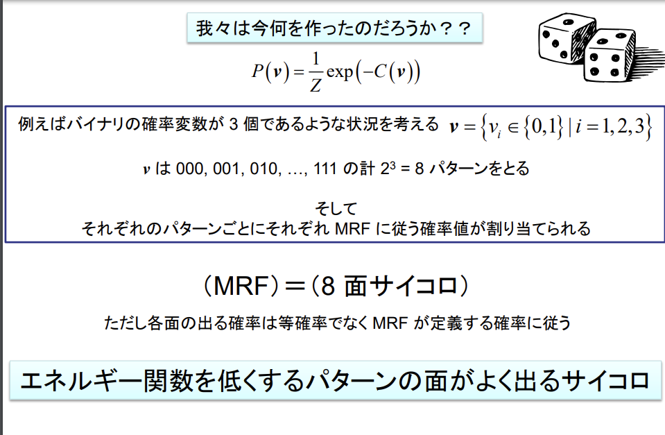

# ボルツマンマシン

モデルパラメータは bとw であり，各 $ b_i $ は各ノード iのバイアスパラメータ，各 $ W_{ij} $ は各リンク (i,j) の重み（相互作用）パラメータと呼ばれる。

また $ w_{ij}= W_{ji} $ (対称性)であるとする。

この確率モデルがボルツマンマシンである。

## ボルツマンマシンのモデル解釈

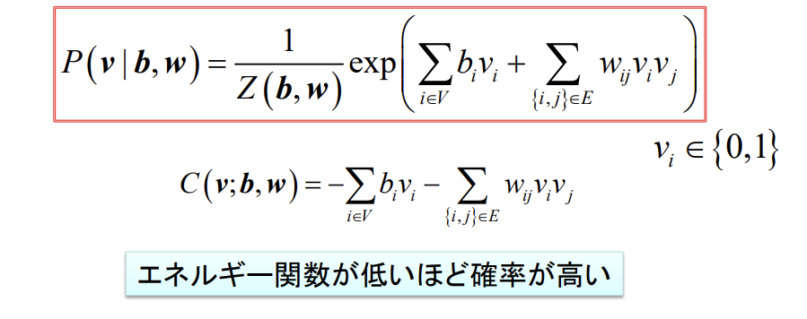

（１）$b_i > 0$ ならば $ v_i = 1 $ のほうがエネルギー関数が低く、確率的に高い。逆に、$b_i < 0$ ならば $ v_i = 0 $ のほうがエネルギー関数が低く、確率的に高い。つまり、$ b_i $ の正負によって対応する　$ v_i $ の出現確率に偏りが出る。そのため、$ b $ はバイアスとよばれる。

(2)$w_{ij} > 0$ ならば、$v_i$ と $v_j$ は同じ値をとったほうがエネルギーが低く、逆に $ fw_{ij} < 0 $ ならば、$ v_i $ と $v_j$ は互いに異なる値をとったほうがエネルギーが低い。つまり、$w$ はリンクで結ばれた変数同士の値の関連性（そろいやすさ、難さ）を調整するパラメータなので、相互作用パラメータと呼ばれる。

例えば、白黒画像の生成モデルにボルツマンマシンを利用することをかんがえる。

画像において、ピクセルは基盤の目上に並べられているので、各確率変数 $v_i$ をそれぞれ白( $ v_i = 1 $ )、黒（ $ v_i = 0 $ ）になる各ピクセルに対応させると、適当なグラフ構造として、以下のような、画像サイズと同じ正方格子型が一つの選択肢となる。

最も近いピクセル同士は強く依存し合うであろうという仮定のもと， リンクは最近接のピクセル間のみに存在するとする．

この場合，バイアスパラメータはそのピクセルの色の偏り（白（または黒）になりやすさ）を表し，重みパラメータは隣同士のピクセルの色のそろいやすさを表すこととなる。

（１）$b_i > 0 $

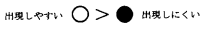

（２）$w_{ij} > 0$

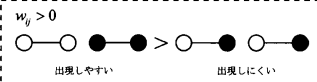

これらのパラメータの値を目的の白黒画像の統計性に合うように設定し，ボルツマンマシンにより目的の白黒画像の生成モデルを再現する．
# ボルツマンマシンの最尤推定

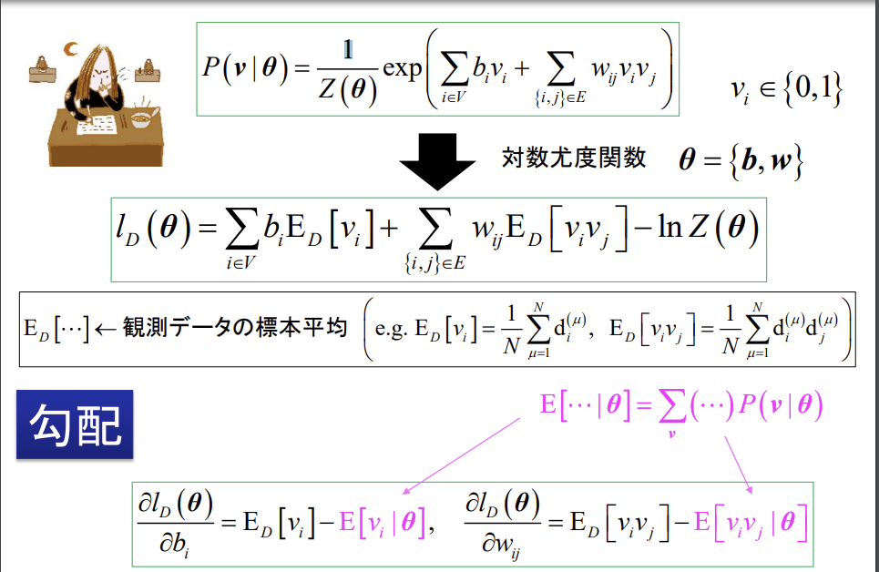

## なぜ、平均（期待値）がでてくるのか

### ステップ 1: 生成確率の定義

ボルツマンマシンの生成確率は以下のように定義されています。

$$
P(v \mid \theta) = \frac{1}{Z(\theta)} \exp\left(\sum_{i \in V} b_i v_i + \sum_{\{i,j\} \in E} w_{ij} v_i v_j \right)
$$

ここで、 $ b_i $  はバイアス項、 $ w_{ij} $  はノード間の重み、 $ Z(\theta) $  は分配関数（正規化定数）です。

### ステップ 2: 尤度関数の定義
次に、データセット  $ D = \{v^{(1)}, v^{(2)}, \dots, v^{(m)}\} $  が与えられているときの尤度関数は、すべての観測データに対する生成確率の積として定義されます。

$$
L(\theta) = \prod_{v^{(k)} \in D} P(v^{(k)} \mid \theta)
$$

### ステップ 3: 対数尤度関数
対数尤度関数は、上記の尤度関数の対数を取ることで得られます。

$$
             l_D(\theta) = \log L(\theta) = \sum_{v^{(k)} \in D} \log P(v^{(k)} \mid \theta)
$$

これを具体的な生成確率の形に代入すると、

$$
l_D(\theta) = \sum_{v^{(k)} \in D} \left( \sum_{i \in V} b_i v_i^{(k)} + \sum_{\{i,j\} \in E} w_{ij} v_i^{(k)} v_j^{(k)} - \log Z(\theta) \right)
$$

### ステップ 4: 分解と期待値
対数尤度関数をさらに分解すると、

$$
l_D(\theta) = \sum_{i \in V} b_i \sum_{v^{(k)} \in D} v_i^{(k)} + \sum_{\{i,j\} \in E} w_{ij} \sum_{v^{(k)} \in D} v_i^{(k)} v_j^{(k)} - m \log Z(\theta)
$$

データセット  $ D $  には  $ m $  個のサンプルが含まれているとします。サンプルごとの  $ v_i^{(k)} $  の値を合計したものを  $ m $  で割ると、その変数  $ v_i $  のデータセット全体における平均（期待値）が得られます。これを数式で表すと次のようになります。

$$
\mathbb{E}_D[v_i] = \frac{1}{m} \sum_{k=1}^{m} v_i^{(k)}
$$

同様に、 $ v_i v_j $  の期待値も同じ方法で求められます。

$$
\mathbb{E}_D[v_i v_j] = \frac{1}{m} \sum_{k=1}^{m} v_i^{(k)} v_j^{(k)}
$$

この期待値は、サンプル全体における  $ v_i $  や  $ v_i v_j $  の平均を表します。

ここで、定数ｍを無視することで、以下のように書き換えることができます。

$$
l_D(\theta) = \sum_{i \in V} b_i \mathbb{E}_D[v_i] + \sum_{\{i,j\} \in E} w_{ij} \mathbb{E}_D[v_i v_j] - m \log Z(\theta)
$$

これが画像にある対数尤度関数  $ l_D(\theta) $  の導出結果です。

# マルコフ確率場の期待値

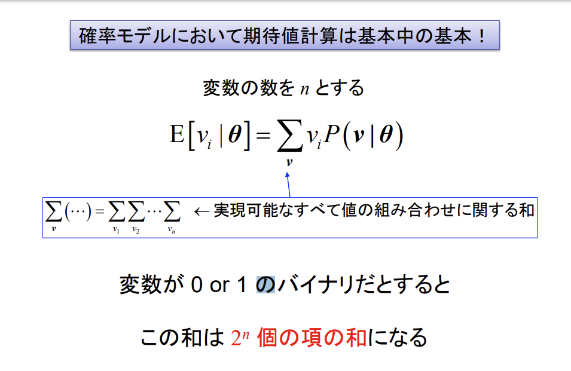

# 組み合わせ爆発の問題

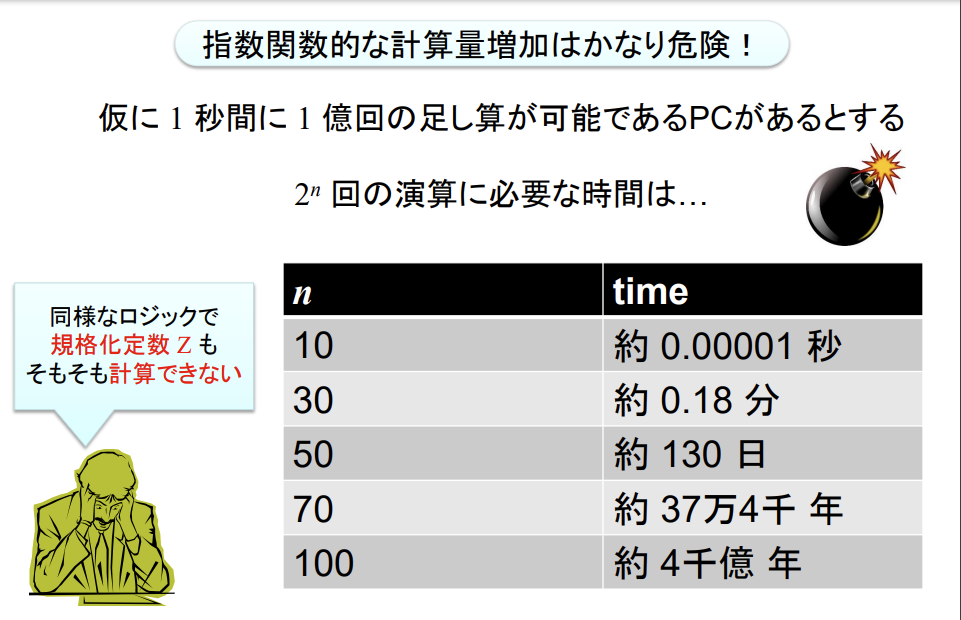